# Web Page: Book Store
**Developer:** Paula Chaves Rivera C02231

---

The project is built using ASP.NET Core and includes several components:

The purpose of this project is to develop an online store using React and Next.js. It allows users the shopping experience of viewing products, adding them to a shopping cart, searching by category, name, and description, and checking out.

## Features
- Product catalog
- Shopping cart
- Checkout process
- Inventory management
- Payment method management
- Campaigns
- Security

---

## Diagrams:

### Activity Diagram

**Purchasing Flow**


### Diagram Packages


---

# Front-end

The front-end of the application is built with React and consists of several components organized in different folders.

- `page.tsx`: This main component renders the application's main page.
- `admin`: This component represents the administration section of the application and contains subcomponents for different administrative tasks.
- `cart`: This component is responsible for displaying the user's shopping cart.
- `confirm`: This component is for confirming the user's order.
- `payment`: This component is for processing the user's order payment and entering purchase data.

---

# Back-end

The main package contains the core business logic of the application.

- `Core`: This subpackage contains the core classes and functions for the application.
- `Business`: This subpackage contains classes and functions related to the business rules of the application.
- `Database`: This subpackage contains classes and functions for interacting with the database.
- `Model`: This subpackage contains classes that represent the application's data models.
- `StoreApi`: This subpackage contains API controllers for sending and receiving data from the front-end.
- `Controller`: This subpackage contains classes that implement specific API controllers.
- `UT`: This subpackage contains unit tests for the back-end code.

---

# Dependencies

- The front-end depends on the back-end to fetch data and perform actions.
- Front-end components communicate with the back-end through APIs.
- The back-end depends on the database to store and retrieve data.

---

## Application Structure Diagram


A[HomePage] --> B{Products}

B --> C{Database}

B --> D{Store}

C --> E{Cache}

---

## Class Diagram


---

**Main Page**
Refers to the main page of the website.

**Controllers**
The controllers are responsible for handling user requests and processing them. They interact with models and views to complete tasks.

**StoreDB**
Represents the database where the system's information is stored.

**SaleDB**
Represents the database where purchases are stored.

**SaleReport**
This class is responsible for generating sales reports.

**SaleReportLogic**
This class provides the logic for generating sales reports.

**StoreLogic**
This class provides the logic for interacting with the store database.

**Data Flow**
1. The user makes a request to the main page.
2. The controllers receive the request and process it.
3. The controllers interact with the models to retrieve or modify data in the database.
4. The controllers interact with the views to generate the response to the user.
5. The views send the response to the user.

**Main Functions of the System**
- Store and retrieve product information.
- Generate sales reports.
- Manage user purchases.

---


## Campaign Activity Diagram


### 1. Admin

#### Start
- The admin opens the campaigns module (`/campannas`).

#### Create Message
- The admin fills out the message form.
- The admin submits the form.
- The server saves the message in the database.
- The server notifies connected clients via WebSockets.

#### Delete Message
- The admin selects a message to delete.
- The server deletes the message from the database.
- The server notifies connected clients via WebSockets.

#### End

### 2. Client

#### Start
- The client connects to the store.
- The store connects to the WebSocket server.

#### Receive Message
- The server sends a notification of a new message.
- The client increments the message counter.

#### View Messages
- The client clicks on the message icon.
- The store requests the last 3 messages from the server.
- The server sends the messages.
- The store displays the messages.

#### End

### Activity Diagram

**Purchasing Flow**

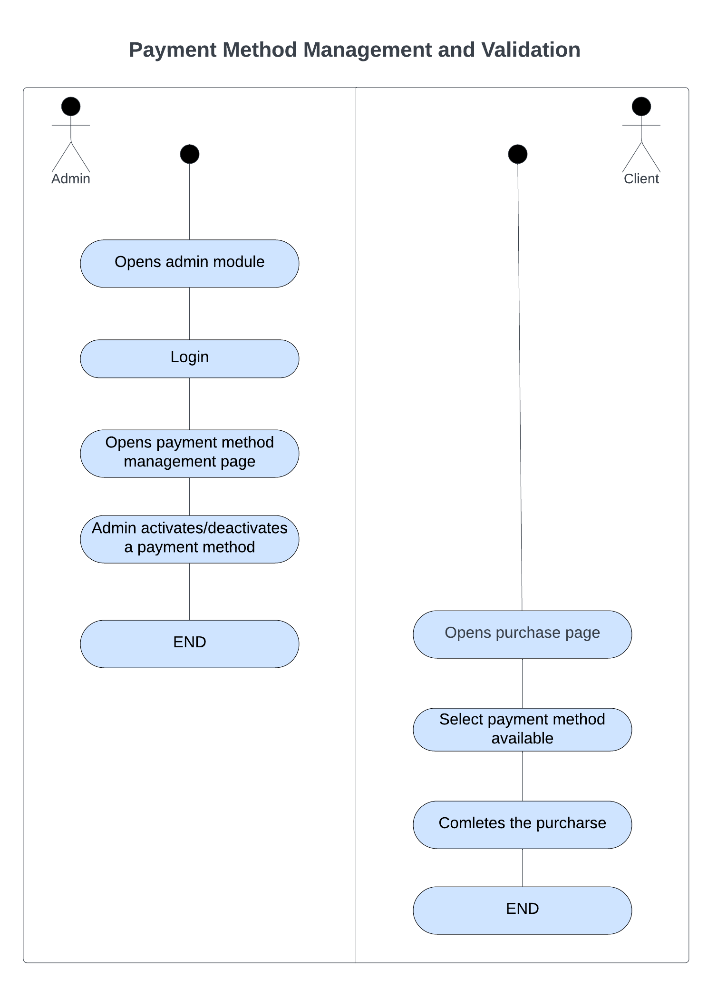


### Activity Diagram

**Purchasing Flow**

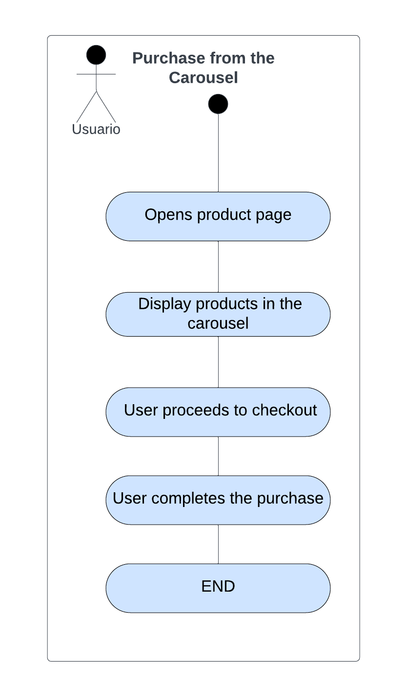


### Diagram

**Payment Method**

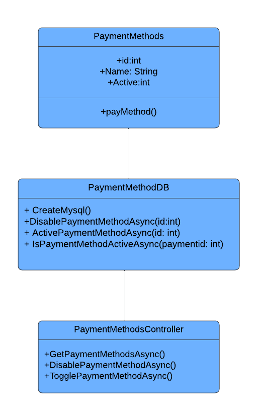


### Diagram

**Quantity**
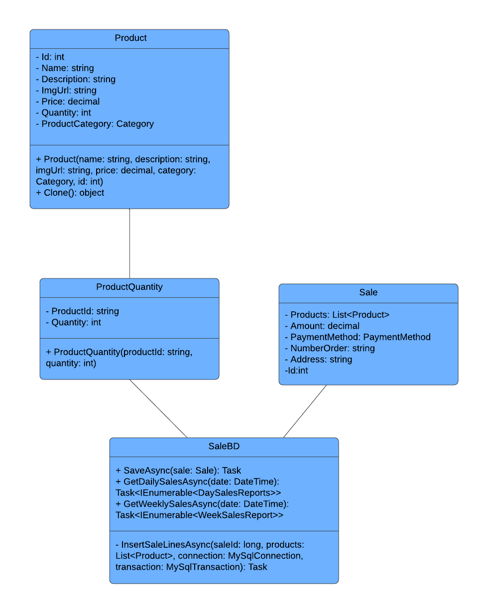

---

# StoreAPI Security Implementation

This section outlines the security mechanisms implemented in the StoreAPI project. The system uses JWT (JSON Web Token) for authentication, ensuring secure access to resources based on user roles.

## Overview


## Security Implementation
Key Components:

1. **LoginModel**:

   - The `LoginModel` class represents the data model for user login.
   - It ensures that both the username and password fields are not null or empty, throwing exceptions if these conditions are violated. This helps prevent invalid data from being processed.


2. **UserAccount**:
   - The `UserAccount` class manages user accounts and their associated roles.
   - It ensures each user has at least one role and that the username and password fields are not null or empty, providing essential validation to maintain data integrity.
   - This class also maintains a static list of user accounts, which is useful for testing and development purposes.


3. **AuthController**:
   - The `AuthController` is responsible for handling login requests.
   - It verifies the provided user credentials against the stored user accounts.
   - If the credentials are valid, it generates a JWT. This token includes claims such as the username and roles, which are used for subsequent authorization checks.
   - The token is signed using a symmetric security key and has an expiration time to enhance security.

```csharp
        [HttpPost]
        [AllowAnonymous]
```
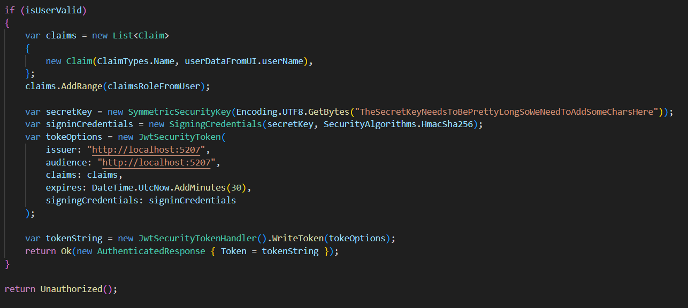


4. **Program Configuration**:
   - In the main configuration file (`Program.cs`), JWT authentication and authorization are set up.
   - This configuration includes specifying the issuer, audience, and the signing key for the JWT, which are crucial for validating the token's authenticity.
   - Additionally, the configuration ensures that the token's lifetime is validated to prevent the use of expired tokens.

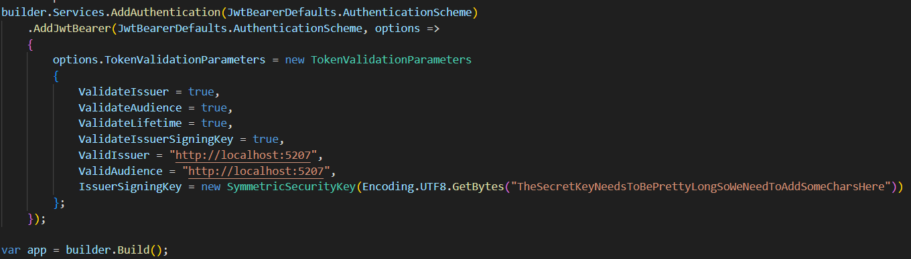


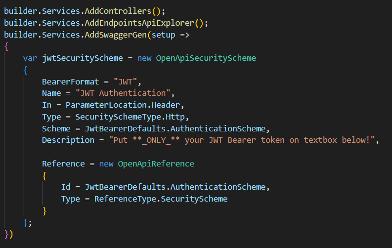


5. **Frontend (React)**:
   - The login page in the frontend sends the user's credentials to the backend.
   - Upon successful authentication, the backend returns a JWT.
   - This token is then stored in the browser's `sessionStorage`, allowing the frontend to include the token in subsequent requests to access protected resources.
   - The frontend also handles error messages and validation feedback to enhance the user experience.

Here is the way the token is stored in the browser.
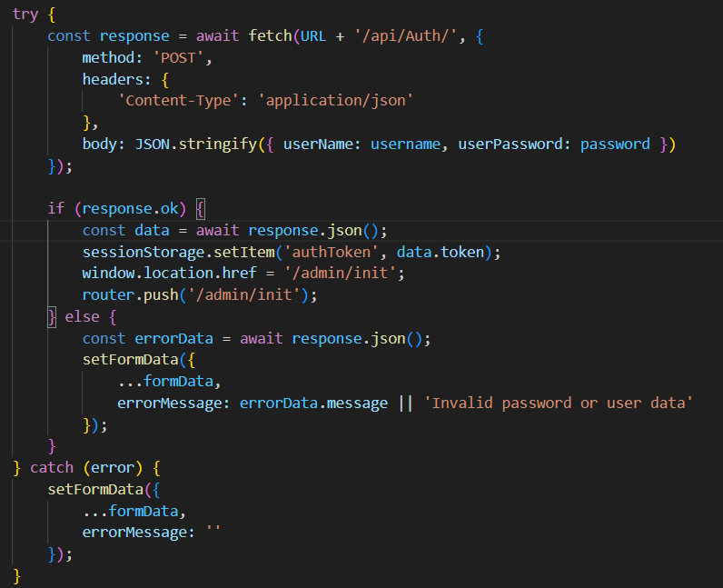

This is the way the page confirm and keeps constantly checking to see if the token is still valid
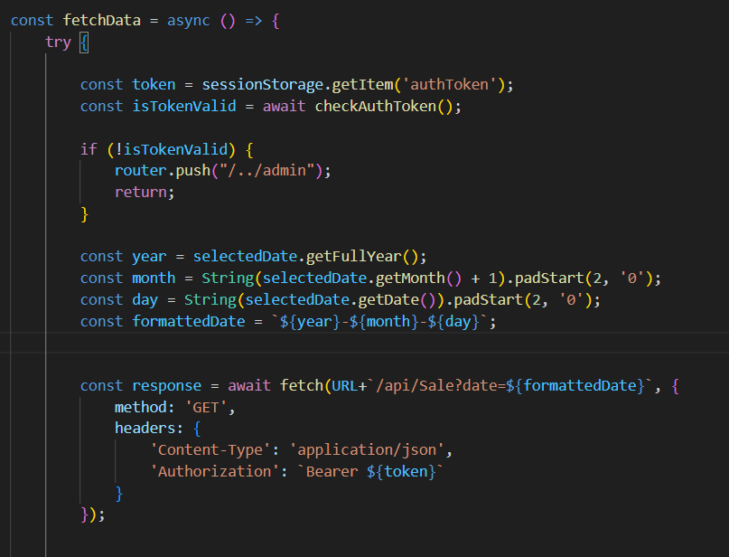


### Security Flow

1. **User Login**:
   - The user provides their username and password through the login form.
   - The frontend sends these credentials to the backend via a POST request.

2. **Credential Verification**:
   - The backend verifies the credentials against the stored user accounts.
   - If the credentials are invalid, the backend responds with an error.

3. **Token Generation**:
   - If the credentials are valid, the backend generates a JWT.
   - The token includes claims for the username and roles, signed with a secure key, and set to expire after a certain period.

4. **Token Storage and Usage**:
   - The frontend receives the token and stores it in `sessionStorage`.
   - For any subsequent requests to protected endpoints, the frontend includes the token in the request headers.

5. **Authorization**:
   - The backend checks the token on each request to protected endpoints.
   - It validates the token's signature, issuer, audience, and expiration time.
   - Based on the token's claims, the backend determines if the user has the necessary permissions to access the requested resource.

### Benefits

- **Secure Authentication**: Using JWT ensures that user credentials are securely transmitted and stored.
- **Statelessness**: JWT allows for a stateless authentication mechanism, reducing the need for server-side session storage.
- **Scalability**: This approach scales well with the application since the token contains all necessary information about the user.
- **Flexibility**: Roles and claims in the token provide fine-grained access control, making it easy to implement different levels of access for various users.

---

### Product cache in StoreAPI

The StoreAPI project includes an efficient caching mechanism to improve performance and reduce database load by caching product data. This approach ensures that product information is readily available for the application without frequent database queries.

### Key Components

1. **Database Retrieval (StoreDB)**:
   - The `StoreDB` class is responsible for retrieving product data from the database.
   - It establishes a connection to the database using `MySqlConnection` and executes a query to fetch all products.
   - The retrieved data is then processed and stored in a list of dictionaries, where each dictionary represents a row with column names as keys and their respective values.


2. **Product Loading and Caching (Store)**:
   - The `Store` class handles loading product data into the application's cache.
   - It includes a private constructor that initializes the product list, categories, and tax percentage.
   - The `InitializeAsync` method asynchronously loads products and categories, then creates an instance of the `Store` class.
   - This instance is stored using a `Lazy<Task<Store>>` to ensure it is initialized only once and shared across the application.
   - The `LoadProductsAsync` method converts the data retrieved by `StoreDB` into a list of `Product` objects.
   - It also includes validation to ensure the data is correctly parsed and that each product is associated with a valid category.

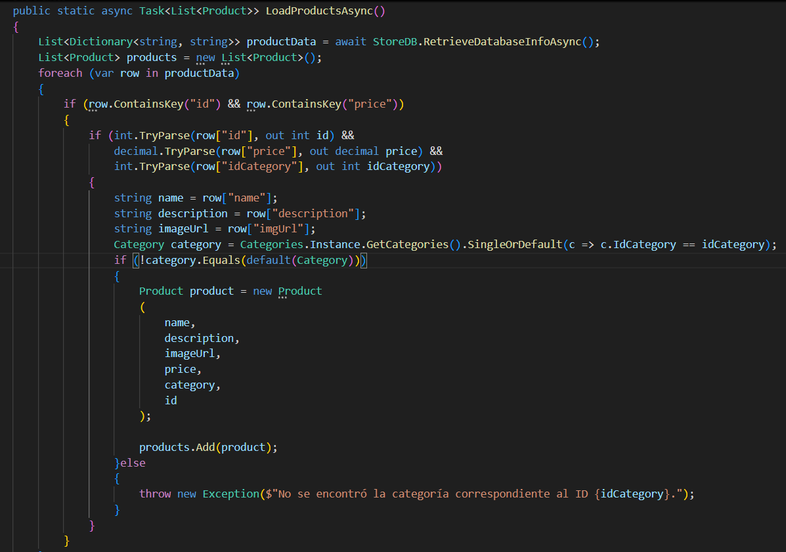

### Caching Flow

1. **Database Connection**:
   - The `RetrieveDatabaseInfoAsync` method in `StoreDB` establishes a connection to the MySQL database.
   - It executes a query to fetch all rows from the `products` table and processes the results into a list of dictionaries.

2. **Data Loading**:
   - The `LoadProductsAsync` method in `Store` calls `RetrieveDatabaseInfoAsync` to get the raw product data.
   - It then iterates through the data, validating and converting each row into a `Product` object.
   - Each `Product` is associated with a `Category`, which is retrieved from the `Categories` singleton.

3. **Caching Initialization**:
   - The `InitializeAsync` method loads products and categories asynchronously and initializes a `Store` instance.
   - This instance is cached using a `Lazy<Task<Store>>` to ensure it is created only once and is reused throughout the application.

4. **Accessing Cached Data**:
   - The `Store.Instance` property provides access to the cached `Store` instance.
   - This ensures that all parts of the application use the same cached data, reducing redundant database queries and improving performance.

### Benefits

- **Performance Improvement**: By caching product data, the application reduces the number of database queries, leading to faster response times.
- **Reduced Database Load**: Caching helps in minimizing the load on the database, which can be especially beneficial for applications with a high number of read operations.
- **Consistency**: The use of a single cached instance ensures that all parts of the application have a consistent view of the product data.
- **Scalability**: The caching mechanism allows the application to scale more efficiently by serving cached data to multiple users without additional database overhead.


---

### Product Search Mechanism in StoreAPI

The product search functionality in StoreAPI is designed to efficiently retrieve products based on specified criteria, including category IDs and search keywords. Here's how the search mechanism operates:

#### Search Criteria

1. **Category Filtering**:
   - Users can search for products within specific categories identified by their unique IDs (`categoryIdsList`).
   - If `categoryIdsList` contains multiple category IDs, the search retrieves products that belong to any of those categories.
   - Including a `0` in `categoryIdsList` triggers a search across all available categories, providing a comprehensive view of products.

2. **Keyword Matching**:
   - Products are searched based on user-provided keywords (`searchKeywords`), which can appear in either the product name or description.
   - The search algorithm ensures that partial matches are also considered, enhancing the likelihood of relevant product retrieval.

#### Search Process

1. **Initialization**:
   - Upon initialization, the `Products` class loads all products from the products cache.

2. **Category-based Search**:
   - Depending on the contents of `categoryIdsList`:
     - If specific category IDs are provided (`categoryIdsList` excluding `0`), the search retrieves products from those categories.
     - If `0` is included in `categoryIdsList`, the search spans all categories, ensuring a broad search scope.

3. **Keyword-based Filtering**:
   - Each product retrieved from the specified categories is evaluated against `searchKeywords`.
   - Products are filtered based on whether the `searchKeywords` match any part of their name or description.
   - The search algorithm efficiently traverses and filters products using techniques like binary search for optimal performance.

### Binary Search Algorithm Overview

Binary search is a classic algorithm for finding a sorted list of products. It works by repeatedly dividing the search interval in half. If the value of the search key is less than the item in the middle of the interval, the algorithm narrows the interval to the lower half. Otherwise, it narrows it to the upper half. This process continues until the algorithm finds the key or determines that it is not present.

### Implementation Details

1. **Input Requirements**:
   - **Sorted List**: The list of products (`products`) must be sorted beforehand, typically by product name to facilitate alphabetical search.
   - **Search Keyword**: The `searchKeywords` parameter specifies the string to search within the product names or descriptions.

2. **Method Signature**:
   The method `BinarySearchProducts` takes two parameters:
   - `products`: A sorted list of products to search within.
   - `searchKeywords`: The string of keywords to match against product names or descriptions.

3. **Algorithm Execution**:
   - **Initialization**: Begin with two pointers, `left` at the start of the list (`0`) and `right` at the end (`products.Count - 1`).
   - **Binary Search Logic**: 
     - Calculate the middle index (`mid`) of the current `left` and `right` pointers.
     - Check if the `Name` or `Description` of the product at `mid` contains the `searchKeywords` using a case-insensitive comparison (`Contains` method with `StringComparison.OrdinalIgnoreCase`).
     - If a match is found, add the product to `matchingProducts`.
     - Expand the search to the left (`temp--`) and right (`temp++`) of the `mid` index to gather all consecutive matches in the sorted list.
   - **Iteration and Convergence**: Continue adjusting the `left` and `right` pointers based on whether the `searchKeywords` precedes or follows the current middle index until the entire list is traversed.

4. **Output**:
   - **Matching Products**: Collect all products that contain the `searchKeywords` in their `Name` or `Description`.
   - **Efficiency**: Binary search operates in O(log n) time complexity, making it highly efficient for large sorted datasets compared to linear search algorithms.

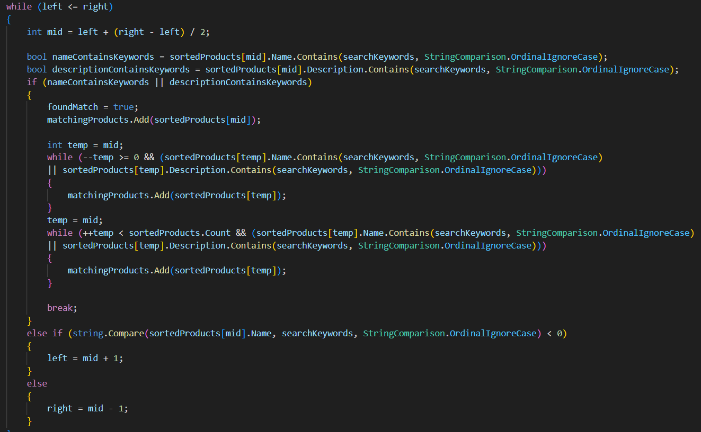
 
#### Benefits

- **Efficiency**: By organizing products into categorized and indexed data structures during initialization, the search operation achieves rapid response times even when querying large datasets.
  
- **Flexibility**: Users can tailor searches by combining category IDs and keywords, facilitating precise product discovery based on specific requirements.
  
- **Scalability**: As the product inventory grows, the search mechanism remains scalable due to its efficient data organization and retrieval strategies.

---


### Sale Reports

#### API Backend (C#)

#### Models

1. **DaySalesReports**:
   - Represents daily sales reports including purchase date, purchase number, total amount, products, and quantity.
   - Ensures data validity through constructor validation.

2. **WeekSalesReport**:
   - Represents weekly sales reports including the day of the week and total sales.
   - Constructor validates data input to ensure consistency.

#### SaleBD Class

- **SaveAsync Method**:
  - Saves a sale transaction to the database using MySQL.
  - Begins by opening a database connection and initiating a transaction to ensure data integrity.
  - Executes an `INSERT` query to store basic sale information (date, total, payment method, etc.).
  - Retrieves the last inserted ID to associate sale lines with the main sale entry.
  - Calls `InsertSaleLinesAsync` to store individual product details related to the sale.
  - Commits the transaction upon successful completion or rolls back if an error occurs.

- **InsertSaleLinesAsync Method**:
  - Inserts detailed sale line information (product ID, quantity, final price) associated with a specific sale ID into the database.
  - Uses a loop to iterate through each product in the sale and executes an `INSERT` query for each product.
  - Rolls back the transaction and throws an exception if an error occurs during insertion.

- **GetDailySalesAsync Method**:
  - Retrieves daily sales reports based on a specified date.
  - Uses a SQL query to join `sales`, `saleLines`, and `products` tables to fetch relevant data (purchase date, purchase number, total, quantity, products).
  - Constructs `DaySalesReports` objects from the retrieved data and returns a list of daily sales reports.

- **GetWeeklySalesAsync Method**:
  - Retrieves weekly sales reports based on a specified date.
  - Uses a SQL query to aggregate sales data by day of the week (`DAYNAME` function) and calculate total sales.
  - Constructs `WeekSalesReport` objects from the retrieved data and returns a list of weekly sales reports.

#### SaleReportLogic Class

- **GetSalesReportAsync Method**:
  - Orchestrates the retrieval of both daily and weekly sales reports.
  - Utilizes `GetDailySalesAsync` and `GetWeeklySalesAsync` methods from `SaleBD` to fetch respective reports asynchronously.
  - Constructs a `SalesReport` object containing both daily and weekly sales data and returns it.

### Frontend (React)

#### ReportPage Component

- **Initialization**:
  - Initializes state variables (`selectedDate`, `weeklySalesData`, `dailySalesData`, `isAuthenticated`) using React hooks (`useState` and `useEffect`).
  - Manages authentication using JWT tokens retrieved from session storage to ensure secure access to the sales report page.

- **Fetching Data**:
  - Implements `fetchData` function to fetch sales data from the API based on the selected date.
  - Uses `fetch` API to send a GET request to the API endpoint (`/api/Sale`) with appropriate headers including the JWT token for authorization.
  - Parses JSON response and updates `dailySalesData` and `weeklySalesData` states to populate charts.

- **User Interaction**:
  - Utilizes `DatePicker` from `react-datepicker` to allow users to select a specific date for fetching sales data.
  - Implements `handleDayChange` to update `selectedDate` state upon user interaction with the date picker.

- **Rendering**:
  - Renders two charts using `react-google-charts` (`Table` for daily sales and `PieChart` for weekly sales) to visualize sales data fetched from the API.
  - Includes error handling to redirect unauthorized users back to the login page (`/admin`).

### Importance of `react-google-charts`

1. **Ease of Use and Customization**:
   - `react-google-charts` simplifies the process of integrating Google Charts into React applications. It provides components like `Table` and `PieChart` that are easy to configure and use with React's component-based architecture.

2. **Integration with React Ecosystem**:
   - As a widely used library within the React ecosystem, `react-google-charts` benefits from community support, regular updates, and compatibility with other React libraries and tools. This makes it a reliable choice for developers building data visualization features.

3. **Data Security and Privacy**:
   - When displaying sensitive data like sales figures, ensuring data security and privacy is paramount. This involves implementing secure data transmission (e.g., HTTPS), validating user permissions (as mentioned in the error handling), and adhering to data protection regulations (e.g., GDPR).
