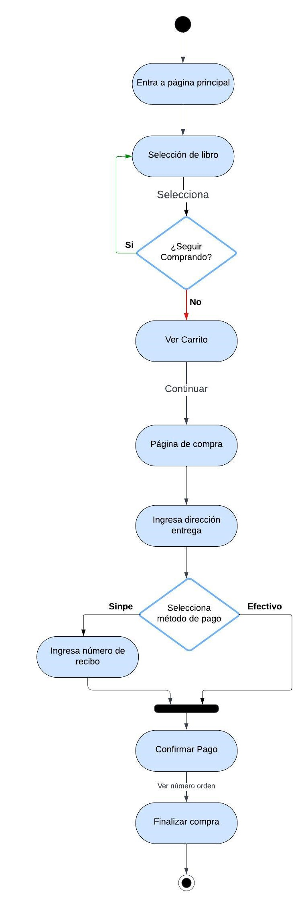
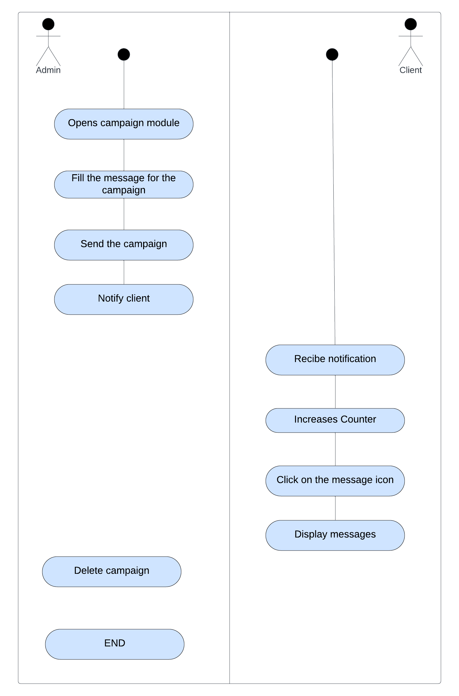

# Web Pages: Book Store
**Developer:** Paula Chaves Rivera C02231

---

The purpose of this project is to develop an online store using React and Next.js. It allows users the shopping experience of viewing products, adding them to a shopping cart, searching by category, name, and description, and checking out.

## Features
- Product catalog
- Shopping cart
- Checkout process
- Inventory management
- Payment method management
- Campaigns

---

## Diagrams:

### Activity Diagram

**Purchasing Flow**

### Diagram Packages

---

# Front-end

The front-end of the application is built with React and consists of several components organized in different folders.

- `page.tsx`: This main component renders the application's main page.
- `admin`: This component represents the administration section of the application and contains subcomponents for different administrative tasks.
- `cart`: This component is responsible for displaying the user's shopping cart.
- `confirm`: This component is for confirming the user's order.
- `payment`: This component is for processing the user's order payment and entering purchase data.

---

# Back-end

The main package contains the core business logic of the application.

- `Core`: This subpackage contains the core classes and functions for the application.
- `Business`: This subpackage contains classes and functions related to the business rules of the application.
- `Database`: This subpackage contains classes and functions for interacting with the database.
- `Model`: This subpackage contains classes that represent the application's data models.
- `StoreApi`: This subpackage contains API controllers for sending and receiving data from the front-end.
- `Controller`: This subpackage contains classes that implement specific API controllers.
- `UT`: This subpackage contains unit tests for the back-end code.

---

# Dependencies

- The front-end depends on the back-end to fetch data and perform actions.
- Front-end components communicate with the back-end through APIs.
- The back-end depends on the database to store and retrieve data.

---

## Application Structure Diagram

A[HomePage] --> B{Products}

B --> C{Database}

B --> D{Store}

C --> E{Cache}

---

## Class Diagram

---

# Main Page
Refers to the main page of the website.

## Controllers
The controllers are responsible for handling user requests and processing them. They interact with models and views to complete tasks.

## StoreDB
Represents the database where the system's information is stored.

## SaleDB
Represents the database where purchases are stored.

## SaleReport
This class is responsible for generating sales reports.

## SaleReportLogic
This class provides the logic for generating sales reports.

## StoreLogic
This class provides the logic for interacting with the store database.

## Data Flow
1. The user makes a request to the main page.
2. The controllers receive the request and process it.
3. The controllers interact with the models to retrieve or modify data in the database.
4. The controllers interact with the views to generate the response to the user.
5. The views send the response to the user.

## Main Functions of the System
- Store and retrieve product information.
- Generate sales reports.
- Manage user purchases.

---

## Campaign Activity Diagram

### 1. Admin

#### Start
- The admin opens the campaigns module (`/campannas`).

#### Create Message
- The admin fills out the message form.
- The admin submits the form.
- The server saves the message in the database.
- The server notifies connected clients via WebSockets.

#### Delete Message
- The admin selects a message to delete.
- The server deletes the message from the database.
- The server notifies connected clients via WebSockets.

#### End

### 2. Client

#### Start
- The client connects to the store.
- The store connects to the WebSocket server.

#### Receive Message
- The server sends a notification of a new message.
- The client increments the message counter.

#### View Messages
- The client clicks on the message icon.
- The store requests the last 3 messages from the server.
- The server sends the messages.
- The store displays the messages.

#### End

---
