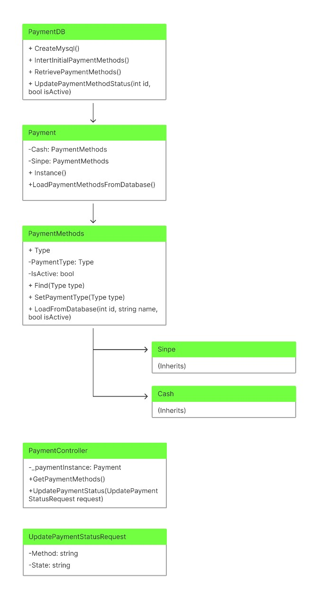

# Online Store Project

## Index

1. [Introduction](#introduction)
2. [System Architecture](#system-architecture)
3. [UML Diagrams](#uml-diagrams)
    - [Activity Diagram](#activity-diagram)
    - [Class Diagram](#class-diagram)
    - [Package Diagram](#package-diagram)
    - [Campaigns Investigation Diagram](#campaigns-investigation-diagram)
    - [Activity Diagram for Carousel and PaymentMethods](#activity-diagram-for-carousel-and-paymentmethods)
4. [Project Setup](#project-setup)
5. [Security](#security)
6. [Cache Products](#How-Product-Caching-Was-Implemented)
7. [Product Finder](#PRODUCT-FINDER) 
8. [Sales Report](#Sales-Reports)
9. [Video Demostration](#Video-Demonstration)
   

## Introduction

This online store project was developed during the Programming Languages course. The store allows users to browse products, add them to the cart, make purchases, and view sales statistics. The implementation uses modern technologies and good development practices.

## System Architecture

The system is designed to be modular and scalable, with a microservices architecture that includes services for product management, users, authentication and authorization, and sales statistics. Communication between services is done via RESTful APIs.

## UML Diagrams

### Activity Diagram


The activity diagram shows the workflow within the system, from user authentication to making a purchase.

### Class Diagram


The class diagram represents the static structure of the system, showing classes, attributes, methods, and their relationships.

### Package Diagram


The package diagram shows the modular organization of the system, grouping related classes into packages to improve code maintainability and scalability.

### Campaigns Investigation Diagram


This diagram illustrates the structure and relationships of the research campaigns within the system.

### Activity Diagram for Carousel and Payment Methods


The diagram shows the activity flows related to the product carousel and the available payment methods.

### UML Project Diagram



This diagram provides an overview of the structure and components of the online store project.


## Project Setup

To set up the project, follow the steps below:

1. **Clone the repository**:
    ```bash
    git clone https://github.com/user/online-store.git
    cd online-store
    ```

2. **Install dependencies**:
    ```bash
    dotnet restore
    ```

3. **Configure the database**:
    - Ensure you have a configured database and update the connection string in `appsettings.json`.

4. **Run migrations**:
    ```bash
    dotnet ef database update
    ```

5. **Start the application**:
    ```bash
    dotnet run
    ```

# Security

Security in this project is implemented using JWT (JSON Web Tokens) for authentication and authorization. Below is a summary of the steps and code needed to configure this security:

1. **JWT Configuration in `Program.cs`**:
    ```csharp
    using System.Text;
    using Microsoft.AspNetCore.Authentication.JwtBearer;
    using Microsoft.IdentityModel.Tokens;
    using Microsoft.OpenApi.Models;

    var builder = WebApplication.CreateBuilder(args);

    // Configure JWT authentication services
    builder.Services.AddAuthentication(JwtBearerDefaults.AuthenticationScheme)
        .AddJwtBearer(options =>
        {
            options.TokenValidationParameters = new TokenValidationParameters
            {
                ValidateIssuer = true,
                ValidateAudience = true,
                ValidateLifetime = true,
                ValidateIssuerSigningKey = true,
                ValidIssuer = "http://localhost:7043",
                ValidAudience = "http://localhost:7043",
                IssuerSigningKey = new SymmetricSecurityKey(Encoding.UTF8.GetBytes("TheSecretKeyNeedsToBePrettyLongSoWeNeedToAddSomeCharsHere"))
            };
        });

    // Configure Swagger to include JWT authentication
    builder.Services.AddSwaggerGen(setup =>
    {
        var jwtSecurityScheme = new OpenApiSecurityScheme
        {
            BearerFormat = "JWT",
            Name = "JWT Authentication",
            In = ParameterLocation.Header,
            Type = SecuritySchemeType.Http,
            Scheme = JwtBearerDefaults.AuthenticationScheme,
            Description = "Put **_ONLY_** your JWT Bearer token on textbox below!",

            Reference = new OpenApiReference
            {
                Id = JwtBearerDefaults.AuthenticationScheme,
                Type = ReferenceType.SecurityScheme
            }
        };

        setup.AddSecurityDefinition(jwtSecurityScheme.Reference.Id, jwtSecurityScheme);

        setup.AddSecurityRequirement(new OpenApiSecurityRequirement
        {
            { jwtSecurityScheme, Array.Empty<string>() }
        });
    });
    ```

## Authentication and Authorization

### User Model and Seeder:
A user model with roles is created and a seeder is used to initialize the users.

```csharp
using System;
using System.Collections.Generic;
using System.Security.Claims;

namespace storeapi.Models
{
    public class UserAccount
    {
        public string UserName { get; }
        public string UserPassword { get; }
        public IEnumerable<Claim> UserRoles { get; }

        public static readonly List<UserAccount> allUsers = new List<UserAccount>();

        public static IEnumerable<UserAccount> AllUsersData => allUsers.AsReadOnly();

        public UserAccount(string userName, string userPassword, List<Claim> userRoles)
        {
            if (userRoles == null || userRoles.Count == 0)
                throw new ArgumentException("Roles must be created for users");
            if (string.IsNullOrEmpty(userName))
                throw new ArgumentException("Null users cannot exist");
            if (string.IsNullOrEmpty(userPassword))
                throw new ArgumentException("Password must exist");

            UserName = userName;
            UserPassword = userPassword;
            UserRoles = new List<Claim>(userRoles);

            allUsers.Add(this);
        }
    }

    public static class UserAccountSeeder
    {
        public static void SeedUsers()
        {
            new UserAccount("mariano", "123456", new List<Claim>
            {
                new Claim(ClaimTypes.Name, "mariano"),
                new Claim(ClaimTypes.Role, "Admin")
            });

            new UserAccount("juan", "234567", new List<Claim>
            {
                new Claim(ClaimTypes.Name, "juan"),
                new Claim(ClaimTypes.Role, "user")
            });

            new UserAccount("sofia", "345678", new List<Claim>
            {
                new Claim(ClaimTypes.Name, "sofia"),
                new Claim(ClaimTypes.Role, "Admin")
            });
        }
    }
}
```

## Authentication Controller:
## A controller is created to handle login requests and generate JWT tokens.
```csharp

using System;
using System.Collections.Generic;
using System.IdentityModel.Tokens.Jwt;
using System.Linq;
using System.Security.Claims;
using System.Text;
using Microsoft.AspNetCore.Authorization;
using Microsoft.AspNetCore.Hosting;
using Microsoft.AspNetCore.Mvc;
using Microsoft.IdentityModel.Tokens;
using storeapi.Models;

namespace storeapi.Controllers
{
    [Route("api/[controller]")]
    [ApiController]
    public class AuthController : ControllerBase
    {
        private readonly IWebHostEnvironment hostEnvironment;

        public AuthController(IWebHostEnvironment hostEnvironment)
        {
            this.hostEnvironment = hostEnvironment;
            UserAccountSeeder.SeedUsers();
        }

        private bool IsDevelopmentEnvironment => hostEnvironment.EnvironmentName == "Development";

        [HttpPost("login")]
        [AllowAnonymous]
        public IActionResult Login([FromBody] LoginModel user)
        {
            if (user == null || string.IsNullOrEmpty(user.userName) || string.IsNullOrEmpty(user.userPassword))
                return BadRequest("Invalid client request");

            if (IsDevelopmentEnvironment)
            {
                var existingUser = UserAccount.AllUsersData.FirstOrDefault(u => 
                    u.UserName == user.userName && u.UserPassword == user.userPassword);

                if (existingUser != null)
                {
                    var claims = new List<Claim>
                    {
                        new Claim(ClaimTypes.Name, existingUser.UserName)
                    };
                    claims.AddRange(existingUser.UserRoles);

                    var secretKey = new SymmetricSecurityKey(Encoding.UTF8.GetBytes("TheSecretKeyNeedsToBePrettyLongSoWeNeedToAddSomeCharsHere"));
                    var signinCredentials = new SigningCredentials(secretKey, SecurityAlgorithms.HmacSha256);

                    var tokenOptions = new JwtSecurityToken(
                        issuer: "http://localhost:7043",
                        audience: "http://localhost:7043",
                        claims: claims,
                        expires: DateTime.Now.AddDays(30),
                        signingCredentials: signinCredentials
                    );

                    var tokenString = new JwtSecurityTokenHandler().WriteToken(tokenOptions);

                    return Ok(new AuthenticatedResponse { Token = tokenString });
                }
            }

            return Unauthorized();
        }
    }

    public class AuthenticatedResponse
    {
        public string Token { get; set; }
    }
}
```
## Security Front-end

State Management: Uses useState to manage form data (username, password, errorMessage).
Input Handling: handleInputChange updates state when input fields change.
Form Submission:
Validates inputs to ensure they are not empty.
Sends a POST request to the authentication endpoint.
Decodes the JWT token from the response to check for the 'Admin' role.
If the user has the 'Admin' role, stores the token and redirects to the admin page.
If not, displays an error message.
UI: Renders a form with fields for username and password, and displays error messages if any.


```csharp

import React, { useState } from 'react';
import 'bootstrap/dist/css/bootstrap.css';
import jwtDecode from 'jwt-decode';

const Admin = () => {
  const [formData, setFormData] = useState({
    username: '',
    password: '',
    errorMessage: ''
  });

  const handleInputChange = (e) => {
    const { name, value } = e.target;
    setFormData({ ...formData, [name]: value });
  };

  const handleSubmit = async (e) => {
    e.preventDefault();
    const { username, password } = formData;

    if (!username.trim() || !password.trim()) {
      setFormData({ ...formData, errorMessage: 'Please fill in all fields.' });
      return;
    }

      const response = await fetch(`${process.env.NEXT_PUBLIC_API}/api/Auth/login`, {
        method: 'POST',
        headers: { 'Content-Type': 'application/json' },
        body: JSON.stringify({ userName: username, userPassword: password })
      });

      const data = await response.json();
      if (response.ok) {
        const decodedToken = jwtDecode(data.token);
        if (decodedToken.roles.includes('Admin')) {
          sessionStorage.setItem('authToken', data.token);
          window.location.href = '/admin/init';
        } else {
          setFormData({ ...formData, errorMessage: 'User does not have Admin role.' });
        }
      } else {
        setFormData({ ...formData, errorMessage: data.message || 'Invalid credentials.' });
      }
   
  };

  return (
    <div>
      <h1>Login</h1>
      <form onSubmit={handleSubmit}>
        <div>
          <label htmlFor="username">Username:</label>
          <input type="text" id="username" name="username" value={formData.username} onChange={handleInputChange} />
        </div>
        <div>
          <label htmlFor="password">Password:</label>
          <input type="password" id="password" name="password" value={formData.password} onChange={handleInputChange} />
        </div>
        <button type="submit">Login</button>
      </form>
      {formData.errorMessage && <p style={{ color: 'red' }}>{formData.errorMessage}</p>}
    </div>
  );
};

export default Admin;


```
# How Product Caching Was Implemented

Product caching was first implemented by creating an array and saving it in the database. Then, these products are retrieved from the database and stored in memory cache to improve performance. Below is a detailed explanation of how this process was implemented.

Creating and Saving Products in the Database

First, random products are created and inserted into the MySQL database. A delegate is used here to handle the insertion of products into the database.

```csharp
using System;
using System.Collections.Generic;
using MySqlConnector;
using storeapi.Models;

namespace storeapi.Database
{
    public sealed class StoreDB
    {
        // Delegate to insert a product
        public delegate void InsertProductDelegate(Product product, MySqlConnection connection, MySqlTransaction transaction);

        public static void CreateMysql()
        {
            using (var connection = new MySqlConnection(DataConnection.Instance.ConnectionString))
            {
                connection.Open();

                // Create the products table if it does not exist
                string createTableQuery = @"
                    CREATE TABLE IF NOT EXISTS products (
                        id INT AUTO_INCREMENT PRIMARY KEY,
                        name VARCHAR(100) NOT NULL,
                        price DECIMAL(10, 2) NOT NULL,
                        image TEXT NOT NULL,
                        description VARCHAR(255) NOT NULL,
                        category INT NOT NULL
                    )";

                using (var createTableCommand = new MySqlCommand(createTableQuery, connection))
                {
                    createTableCommand.ExecuteNonQuery();
                }

                // Check if there are already products in the table
                string checkProductsQuery = "SELECT COUNT(*) FROM products";
                using (var checkProductsCommand = new MySqlCommand(checkProductsQuery, connection))
                {
                    int productCount = Convert.ToInt32(checkProductsCommand.ExecuteScalar());
                    if (productCount > 0) return;
                }

                // Sample products to insert
                var products = new List<Product>
                {
                    new Product { Name = "Gizmo", Price = 19.99m, ImageUrl = "image1.jpg", Description = "A cool gizmo", Category = new Category { Id = 1 } },
                    new Product { Name = "Widget", Price = 29.99m, ImageUrl = "image2.jpg", Description = "A useful widget", Category = new Category { Id = 2 } }
                };

                InsertProducts(products, InsertProduct);
            }
        }

        // Method to insert products using a delegate
        public static void InsertProducts(List<Product> products, InsertProductDelegate insertProductDelegate)
        {
            using (var connection = new MySqlConnection(DataConnection.Instance.ConnectionString))
            {
                connection.Open();

                using (var transaction = connection.BeginTransaction())
                {
                    try
                    {
                        foreach (var product in products)
                        {
                            insertProductDelegate(product, connection, transaction);
                        }

                        transaction.Commit();
                    }
                    catch (Exception ex)
                    {
                        transaction.Rollback();
                        throw new Exception($"Error inserting products into database: {ex.Message}");
                    }
                }
            }
        }

        // Delegate method to insert a product
        public static void InsertProduct(Product product, MySqlConnection connection, MySqlTransaction transaction)
        {
            string insertProductQuery = @"
                INSERT INTO products (name, price, description, image, category)
                VALUES (@name, @price, @description, @image, @category)";

            using (var insertCommand = new MySqlCommand(insertProductQuery, connection, transaction))
            {
                insertCommand.Parameters.AddWithValue("@name", product.Name);
                insertCommand.Parameters.AddWithValue("@price", product.Price);
                insertCommand.Parameters.AddWithValue("@description", product.Description);
                insertCommand.Parameters.AddWithValue("@image", product.ImageUrl);
                insertCommand.Parameters.AddWithValue("@category", product.Category.Id);
                insertCommand.ExecuteNonQuery();
            }
        }
    }
}

```

## Retrieving Products and Storing in Memory Cache

After inserting the products into the database, they are retrieved and stored in memory cache to improve performance.

```csharp
 public class InsertProductsLogic
    {
        private readonly IMemoryCache _cache;
        private readonly InsertProductDelegate _insertProductDelegate;

        public delegate void InsertProductDelegate(Product product, MySqlConnection connection, MySqlTransaction transaction);

        public InsertProductsLogic(IMemoryCache cache, InsertProductDelegate insertProductDelegate)
        {
            _cache = cache;
            _insertProductDelegate = insertProductDelegate;
        }

        public List<Product> InsertProduct(Product product)
        {
            ValidateProduct(product);

            var products = _cache.GetOrCreate("Products", entry =>
            {
                entry.AbsoluteExpirationRelativeToNow = TimeSpan.FromMinutes(60);
                return StoreDB.RetrieveDatabaseInfo().Select(row => new Product
                {
                    Name = row[1],
                    Price = decimal.Parse(row[2]),
                    Description = row[3],
                    ImageUrl = row[4],
                    Category = new Category { Id = int.Parse(row[5]) }
                }).ToList();
            });

            using (var connection = new MySqlConnection(DataConnection.Instance.ConnectionString))
            {
                connection.Open();
                using (var transaction = connection.BeginTransaction())
                {
                    try
                    {
                        _insertProductDelegate(product, connection, transaction);
                        transaction.Commit();
                    }
                    catch (Exception ex)
                    {
                        transaction.Rollback();
                        throw new Exception($"Error inserting product into database: {ex.Message}");
                    }
                }
            }

            products.Add(product);
            _cache.Set("Products", products);

            return products;
        }

```

## Explanation of the Delegate
A delegate is a type that represents references to methods with a specific parameter list and return type. In this case, a delegate is used to handle the insertion of products into the database, allowing different implementations of the insertion method to be passed to the business logic.

``` csharp

public delegate void InsertProductDelegate(Product product, MySqlConnection connection, MySqlTransaction transaction);

This delegate defines a method that takes a Product, a MySqlConnection, and a MySqlTransaction as parameters and does not return any value (void).

Using the Delegate
The InsertProducts method uses the InsertProductDelegate to insert products into the database:

public static void InsertProducts(List<Product> products, InsertProductDelegate insertProductDelegate)
{
    using (var connection = new MySqlConnection(DataConnection.Instance.ConnectionString))
    {
        connection.Open();

        using (var transaction = connection.BeginTransaction())
        {
            try
            {
                string deleteProductsQuery = "DELETE FROM products";
                using (var deleteCommand = new MySqlCommand(deleteProductsQuery, connection, transaction))
                {
                    deleteCommand.ExecuteNonQuery();
                }

                foreach (Product product in products)
                {
                    ValidateProductForInsert(product);
                    insertProductDelegate(product, connection, transaction); // Using the delegate
                }

                transaction.Commit();
            }
            catch (Exception ex)
            {
                transaction.Rollback();
                throw new Exception($"Error inserting products into database: {ex.Message}");
            }
        }
    }
}

```
This way, the product insertion logic is flexible and can be easily modified by passing different implementations of the delegate method.

Implementing the Delegate Method
Here is an implementation of the delegate method that inserts a product into the database:
``` csharp
public static void InsertProduct(Product product, MySqlConnection connection, MySqlTransaction transaction)
{
    string insertProductQuery = @"
        INSERT INTO products (name, price, description, image, category)
        VALUES (@name, @price, @description, @image, @category)";

    using (var insertCommand = new MySqlCommand(insertProductQuery, connection, transaction))
    {
        insertCommand.Parameters.AddWithValue("@name", product.Name);
        insertCommand.Parameters.AddWithValue("@price", product.Price);
        insertCommand.Parameters.AddWithValue("@description", product.Description);
        insertCommand.Parameters.AddWithValue("@image", product.ImageUrl);
        insertCommand.Parameters.AddWithValue("@category", product.Category.Id);
        insertCommand.ExecuteNonQuery();
    }
}

```

This implementation of the delegate method performs the actual insertion of a Product into the database using a MySqlCommand.

By using a delegate, the insertion logic can be encapsulated and passed as a parameter, making the code more modular and flexible.

### Explanation of Code: Local Storage Management and Purchase Process

This code handles the shopping cart functionality using React hooks and local storage, and integrates the cart with an API for processing purchases.

#### Key Functions and Hooks

1. **Loading Cart Data from Local Storage**
   ```javascript
   useEffect(() => {
       const cartData = JSON.parse(localStorage.getItem('cartData') || '{}');
       if (cartData.productos) {
         setCarrito(cartData);
       }
   }, []);
   ```
   - **Purpose**: On component mount, this effect loads the cart data from local storage and sets it to the state (`carrito`).
   - **Function**: It retrieves the stored cart data and parses it from JSON. If the cart contains products, it updates the state.

2. **Calculating Subtotal and Total**
   ```javascript
   useEffect(() => {
       let hayProductosEnCarrito = carrito.productos && carrito.productos.length > 0;
       if (hayProductosEnCarrito) {
         let subtotalCalculado = carrito.productos.reduce((total, item) => total + item.price, 0);
         let totalCalculado = (subtotalCalculado * 0.13) + subtotalCalculado;
         setCarrito(prevCarrito => ({
           ...prevCarrito,
           subtotal: subtotalCalculado,
           total: totalCalculado
         }));
       }
   }, [carrito.productos]);
   ```
   - **Purpose**: Calculates the subtotal and total whenever the products in the cart change.
   - **Function**: If there are products in the cart, it calculates the subtotal by summing the prices of all products and then calculates the total including a 13% tax. The state is updated with these values.

3. **Clearing the Cart**
   ```javascript
   const handleClearCart = () => {
       const emptyCart = {
         productos: [],
         subtotal: 0,
         total: 0
       };
       localStorage.setItem('cartData', JSON.stringify(emptyCart));
       setCarrito(emptyCart);
   };
   ```
   - **Purpose**: Clears the cart and updates local storage.
   - **Function**: Sets the cart to an empty state and stores this empty state in local storage.

4. **Processing a Purchase**
   ```javascript
   const dataToSend = {
       productIds: productIds,
       address: direccionEntrega,
       paymentMethod: paymentMethodValue
   };

   const response = await fetch(URL + '/api/Cart', {
       method: 'POST',
       headers: {
           'Content-Type': 'application/json'
       },
       body: JSON.stringify(dataToSend)
   });

   if (response.ok) {
       const responseData = await response.json();
       const { purchaseNumberResponse } = responseData;

       setCart({
           productos: [],
           direccionEntrega: '',
           metodoPago: '',
           isCartEmpty: true,
           numeroCompra: purchaseNumberResponse.toString(),
           sinpeAvailable: false,
           cashAvailable: false
       });

       updateLocalStorage({
           productos: [],
           direccionEntrega: '',
           metodoPago: '',
           isCartEmpty: true,
           numeroCompra: purchaseNumberResponse.toString(),
           sinpeAvailable: false,
           cashAvailable: false
       });
   } else {
       const errorResponseData = await response.json();
       throw new Error('Error al enviar datos de pago: ' + JSON.stringify(errorResponseData));
   }
   ```
   - **Purpose**: Sends the cart data to the API for processing the purchase and handles the response.
   - **Function**: Prepares data to send, makes a POST request to the API, and handles the response. If successful, it clears the cart and updates both the state and local storage. If there's an error, it throws an exception.

5. **Adding a Product to the Cart**
   ```javascript
   const handleAddToCart = (product) => {
       if (!product || typeof product !== 'object' || !product.hasOwnProperty('id') || !product.hasOwnProperty('name') || !product.hasOwnProperty('price')) {
         throw new Error('Invalid product object');
       }

       const { cart } = state;
       const { productos, count } = cart;
       const isProductInCart = productos.some((item) => item.id === product.id);

       if (!isProductInCart) {
         const updatedCart = {
           ...cart,
           productos: [...productos, product],
           count: count + 1,
         };

         setState((prevState) => ({
           ...prevState,
           cart: updatedCart,
         }));

         localStorage.setItem('cartData', JSON.stringify(updatedCart));
       } else {
         throw new Error('Product is already in the cart');
       }
   };
   ```
   - **Purpose**: Adds a product to the cart if it is not already present.
   - **Function**: Validates the product object, checks if the product is already in the cart, and updates the cart state and local storage if the product is new.

### Summary

- **Local Storage Management**: The cart data is saved to and loaded from local storage to persist the cart across sessions.
- **Subtotal and Total Calculation**: Automatically recalculates the subtotal and total when the cart contents change.
- **API Integration**: Sends the cart data to the API to process the purchase, and handles the response to update the cart state and local storage.
- **Product Management**: Ensures products are correctly added to the cart and prevents duplicates.


# PRODUCT FINDER

### Simplified Code with Explanation

#### Overview
The `Products` class manages a collection of products using a binary search tree (BST) and caches product data to improve performance. It includes methods for loading products from a database, caching them, and searching them by category and keyword.

#### TreeNode Class
This class represents a node in the binary search tree.

```csharp
public class TreeNode
{
    public Dictionary<string, string> Product { get; set; }
    public TreeNode Left { get; set; }
    public TreeNode Right { get; set; }

    public TreeNode(Dictionary<string, string> product)
    {
        Product = product;
        Left = null;
        Right = null;
    }
}
```

- **Product**: Holds the product data.
- **Left** and **Right**: References to the left and right children in the BST.

#### Products Class
This class manages the binary search tree and caches product data.

##### Properties and Constructor

```csharp
public sealed class Products
{
    private TreeNode root;
    private static List<Dictionary<string, string>> _cachedProducts;
    private static readonly object _cacheLock = new object();
    private DateTime lastCacheRefreshTime = DateTime.MinValue;
    private readonly TimeSpan cacheRefreshInterval = TimeSpan.FromMinutes(30);

    public Products()
    {
        root = null;
    }
}
```

- **root**: The root node of the BST.
- **_cachedProducts**: A static list to cache products.
- **_cacheLock**: An object for synchronizing access to the cache.
- **lastCacheRefreshTime**: Tracks the last time the cache was refreshed.
- **cacheRefreshInterval**: Interval after which the cache needs to be refreshed.

##### NeedsCacheRefresh Method
Determines if the cache needs to be refreshed.

```csharp
private bool NeedsCacheRefresh()
{
    return DateTime.Now - lastCacheRefreshTime > cacheRefreshInterval;
}
```

##### LoadProductsFromDatabase Method
Loads products from the database, refreshes the cache if needed, and filters products based on category and search keyword.

```csharp
public IEnumerable<Dictionary<string, string>> LoadProductsFromDatabase(List<int> categoryIds, string search)
{
    if (_cachedProducts == null || _cachedProducts.Count == 0 || NeedsCacheRefresh())
    {
        lock (_cacheLock)
        {
            if (_cachedProducts == null || _cachedProducts.Count == 0 || NeedsCacheRefresh())
            {
                List<string[]> productData = StoreDB.RetrieveDatabaseInfo();
                root = null;
                _cachedProducts = new List<Dictionary<string, string>>();

                foreach (string[] row in productData)
                {
                    if (row == null || row.Length < 6) continue;
                    var productDict = CreateProductDictionary(row);
                    if (ValidateProductDictionary(productDict))
                    {
                        Insert(productDict);
                        _cachedProducts.Add(productDict);
                    }
                }

                lastCacheRefreshTime = DateTime.Now;
            }
        }
    }

    IEnumerable<Dictionary<string, string>> result = _cachedProducts;
    if (!string.IsNullOrWhiteSpace(search) && !search.Equals("null", StringComparison.OrdinalIgnoreCase))
    {
        result = SearchProductsByKeyword(root, search);
    }

    if (categoryIds != null && categoryIds.Count > 0)
    {
        List<Dictionary<string, string>> categoryFilteredProducts = new List<Dictionary<string, string>>();
        SearchByCategories(root, categoryIds, categoryFilteredProducts);
        result = result.Intersect(categoryFilteredProducts, new DictionaryEqualityComparer());
    }

    return result;
}
```

- **Cache Management**: Checks if the cache needs to be refreshed and reloads products from the database if necessary.
- **Filtering**: Filters products based on the provided categories and search keyword.

##### Insert Method
Inserts a product into the BST.

```csharp
public void Insert(Dictionary<string, string> product)
{
    if (root == null)
    {
        root = new TreeNode(product);
    }
    else
    {
        InsertRecursively(root, product);
    }
}

private void InsertRecursively(TreeNode node, Dictionary<string, string> product)
{
    if (product == null) throw new ArgumentNullException(nameof(product));

    if (!int.TryParse(node.Product["categoryId"], out int currentCategoryId))
        throw new ArgumentException("Invalid category ID in node.");

    if (!int.TryParse(product["categoryId"], out int newCategoryId))
        throw new ArgumentException("Invalid category ID in product.");

    if (newCategoryId < currentCategoryId)
    {
        if (node.Left == null)
        {
            node.Left = new TreeNode(product);
        }
        else
        {
            InsertRecursively(node.Left, product);
        }
    }
    else
    {
        if (node.Right == null)
        {
            node.Right = new TreeNode(product);
        }
        else
        {
            InsertRecursively(node.Right, product);
        }
    }
}
```

- **Insert**: Inserts the product into the BST at the appropriate position based on the category ID.

##### SearchProductsByKeyword Method
Searches for products containing a specified keyword.

```csharp
public IEnumerable<Dictionary<string, string>> SearchProductsByKeyword(TreeNode node, string keyword)
{
    if (node == null) throw new ArgumentNullException(nameof(node));
    if (string.IsNullOrEmpty(keyword)) throw new ArgumentException("Keyword cannot be null or empty.", nameof(keyword));

    List<Dictionary<string, string>> result = new List<Dictionary<string, string>>();
    SearchByKeyword(node, keyword, result);
    return result;
}

private void SearchByKeyword(TreeNode node, string keyword, List<Dictionary<string, string>> result)
{
    if (node == null) return;

    SearchByKeyword(node.Left, keyword, result);

    if (ProductContainsKeyword(node.Product, keyword))
    {
        result.Add(node.Product);
    }

    SearchByKeyword(node.Right, keyword, result);
}

public bool ProductContainsKeyword(Dictionary<string, string> product, string keyword)
{
    if (product == null) throw new ArgumentNullException(nameof(product));
    if (string.IsNullOrEmpty(keyword)) throw new ArgumentException("Keyword cannot be null or empty.", nameof(keyword));

    keyword = keyword.ToLower();
    return product.Values.Any(v => v != null && v.ToLower().Contains(keyword));
}
```

- **SearchProductsByKeyword**: Recursively searches the BST for products containing the specified keyword.

##### SearchByCategories Method
Filters products by category.

```csharp
private void SearchByCategories(TreeNode node, List<int> categoryIds, List<Dictionary<string, string>> result)
{
    if (result == null) throw new ArgumentNullException(nameof(result));
    if (node == null) return;

    if (!node.Product.ContainsKey("categoryId"))
        throw new ArgumentException("Product dictionary does not contain 'categoryId' key.");

    if (!int.TryParse(node.Product["categoryId"], out int currentCategoryId))
        throw new ArgumentException("Invalid category ID in product dictionary.");

    if (categoryIds.Contains(currentCategoryId))
    {
        result.Add(node.Product);
    }

    SearchByCategories(node.Left, categoryIds, result);
    SearchByCategories(node.Right, categoryIds, result);
}
```

- **SearchByCategories**: Recursively searches the BST for products belonging to the specified categories.

##### ValidateProductDictionary Method
Validates a product dictionary.

```csharp
private bool ValidateProductDictionary(Dictionary<string, string> productDict)
{
    if (productDict == null || productDict.Count < 6)
        throw new ArgumentException("Invalid product data dictionary: Insufficient data.");

    if (!int.TryParse(productDict["id"], out int productId) || productId <= 0)
        throw new ArgumentException("Invalid or missing product ID.");

    if (string.IsNullOrWhiteSpace(productDict["name"]))
        throw new ArgumentException("Product name is null or empty.");

    if (string.IsNullOrWhiteSpace(productDict["imageUrl"]))
        throw new ArgumentException("Image URL is null or empty.");

    if (string.IsNullOrWhiteSpace(productDict["description"]))
        throw new ArgumentException("Product description is null or empty.");

    if (!int.TryParse(productDict["categoryId"], out int categoryId) || categoryId <= 0)
        throw new ArgumentException("Invalid or missing category ID.");

    return true;
}
```

- **ValidateProductDictionary**: Ensures the product dictionary contains valid data.

##### CreateProductDictionary Method
Creates a product dictionary from a data row.

```csharp
private Dictionary<string, string> CreateProductDictionary(string[] row)
{
    if (row.Length < 6) throw new ArgumentException("Row data is insufficient.");

    if (!int.TryParse(row[0], out int id) || id <= 0)
        throw new ArgumentException("Invalid or missing product ID.");

    string name = row[1];
    if (string.IsNullOrWhiteSpace(name))
        throw new ArgumentException("Product name is null or empty.");

    if (!decimal.TryParse(row[2], out decimal price) || price < 0)
        throw new ArgumentException("Invalid product price.");

    string imageUrl = row[3];
    if (string.IsNullOrWhiteSpace(imageUrl))
        throw new ArgumentException("Image URL is null or empty.");

    string description = row[4];
    if (string.IsNullOrWhiteSpace(description))
        throw new ArgumentException("Product description is null or empty.");

    if (!int.TryParse(row[5], out int categoryId) || categoryId <= 0)
        throw new ArgumentException("Invalid or missing category ID.");

    return new Dictionary<string, string>
   

 {
        { "id", id.ToString() },
        { "name", name },
        { "price", price.ToString("0.00", CultureInfo.InvariantCulture) },
        { "imageUrl", imageUrl },
        { "description", description },
        { "categoryId", categoryId.ToString() }
    };
}
```

- **CreateProductDictionary**: Converts a data row into a product dictionary with validation.

### Summary

- **TreeNode Class**: Represents a node in the BST.
- **Products Class**: Manages the BST, caches product data, and includes methods for loading products from the database, inserting products into the BST, searching by keyword and category, validating product data, and creating product dictionaries.
- **Caching Mechanism**: Uses a cache to store product data, which is refreshed every 30 minutes.
- **Product Filtering**: Supports filtering products by category and keyword.

### Explanation of `handleSearch` Function

The `handleSearch` function is an asynchronous function that processes a search event to fetch products based on the search query and selected categories. Here’s a step-by-step explanation:

#### Function Definition and Input Validation

```javascript
const handleSearch = async (event) => {
  if (!event || typeof event !== 'object' || !event.hasOwnProperty('target') || typeof event.target !== 'object') {
    throw new Error('Invalid event object');
  }
  event.preventDefault();
```

- **Function Definition**: Declares an asynchronous function named `handleSearch`.
- **Input Validation**: Checks if the `event` object is valid. Throws an error if it is not.

#### Extracting Query and Categories

```javascript
  const query = event.target.q.value.trim();
  const { selectedCategories } = state;
```

- **Query Extraction**: Retrieves the search query from the event's target and trims any whitespace.
- **Selected Categories**: Destructures `selectedCategories` from the component's state.

#### Constructing the API URL

```javascript
  let url = URL + '/api/Products';
  const queryParams = [];
  selectedCategories.forEach((categoryID) => {
    queryParams.push(`categoryIDs=${categoryID}`);
  });
  if (query) {
    queryParams.push(`search=${encodeURIComponent(query)}`);
  } else {
    queryParams.push('search=null');
  }
  if (queryParams.length > 0) {
    url += `?${queryParams.join('&')}`;
  }
```

- **Base URL**: Initializes the URL for the API endpoint.
- **Query Parameters**: Creates an array to hold query parameters.
  - **Category IDs**: Adds each selected category ID to the query parameters.
  - **Search Query**: Adds the search query to the query parameters, URL-encoding it if it exists. If the query is empty, sets `search` to `null`.
- **Final URL**: Appends the query parameters to the URL if any exist.

#### Fetching Products

```javascript
  const response = await fetch(url);
  if (!response.ok) {
    throw new Error('Failed to fetch products');
  }
  const productList = await response.json();
```

- **Fetching Data**: Sends a GET request to the constructed URL.
- **Error Handling**: Throws an error if the response is not OK.
- **Parsing Response**: Parses the JSON response to get the product list.

#### Updating State and URL

```javascript
  setState((prevState) => ({
    ...prevState,
    productList,
  }));

  const searchParams = new URLSearchParams({ categoryIDs: selectedCategories.join(','), search: query || 'null' });
  window.history.pushState(null, '', `${window.location.pathname}?${searchParams.toString()}`);
};
```

- **Updating State**: Updates the component's state with the new product list.
- **Updating URL**: Updates the browser’s URL to reflect the current search parameters using `window.history.pushState` without reloading the page.

### Summary

The `handleSearch` function handles the following:
1. **Event Validation**: Ensures the search event is valid.
2. **Query and Categories Extraction**: Extracts the search query and selected categories from the event and state.
3. **API URL Construction**: Constructs the URL with query parameters for the API request.
4. **Fetching Products**: Fetches products from the API and handles potential errors.
5. **State and URL Update**: Updates the component's state with the fetched products and updates the browser's URL to reflect the search parameters.

This function provides a robust and interactive search experience by dynamically updating the product list and URL based on user input.
# Sales Reports

The following code provides a system for retrieving and managing sales transactions from a MySQL database. It includes database access methods, business logic for sales, and a web API controller.

#### SalesDB Class
Handles database operations related to sales transactions.

##### Constructor
Initializes a new instance of the `SalesDB` class.

```csharp
public sealed class SalesDB
{
    public SalesDB()
    {
    }
}
```

##### GetForWeekAsync Method
Retrieves sales transactions for a specified week.

```csharp
public async Task<IEnumerable<string[]>> GetForWeekAsync(DateTime date)
{
    if (date == DateTime.MinValue)
    {
        throw new ArgumentException("Date cannot be DateTime.MinValue");
    }

    using (MySqlConnection connection = new MySqlConnection(DataConnection.Instance.ConnectionString))
    {
        await connection.OpenAsync();

        DateTime startOfWeek = date.AddDays(-(int)date.DayOfWeek);
        DateTime endOfWeek = startOfWeek.AddDays(6);
        string formattedStartOfWeek = startOfWeek.ToString("yyyy-MM-dd");
        string formattedEndOfWeek = endOfWeek.ToString("yyyy-MM-dd");

        string sql = @"
            SELECT *
            FROM Compras
            WHERE date >= @startOfWeek AND date <= @endOfWeek";

        using (var command = new MySqlCommand(sql, connection))
        {
            command.Parameters.AddWithValue("@startOfWeek", formattedStartOfWeek);
            command.Parameters.AddWithValue("@endOfWeek", formattedEndOfWeek);

            using (var reader = await command.ExecuteReaderAsync())
            {
                var databaseInfo = new List<string[]>();

                while (await reader.ReadAsync())
                {
                    int fieldCount = reader.FieldCount;
                    string[] row = new string[fieldCount];

                    for (int i = 0; i < fieldCount; i++)
                    {
                        row[i] = reader.GetValue(i).ToString();
                    }

                    databaseInfo.Add(row);
                }

                return databaseInfo;
            }
        }
    }
}
```

- **Input Validation**: Checks if the provided date is valid.
- **Database Connection**: Opens a connection to the MySQL database.
- **Query Execution**: Retrieves sales records for the week specified by the date.
- **Result Processing**: Reads the data and returns it as a list of string arrays.

##### GetForDayAsync Method
Retrieves sales transactions for a specified day.

```csharp
public async Task<IEnumerable<string[]>> GetForDayAsync(DateTime date)
{
    if (date == DateTime.MinValue)
    {
        throw new ArgumentException("Date cannot be DateTime.");
    }

    await using (MySqlConnection connection = new MySqlConnection(DataConnection.Instance.ConnectionString))
    {
        await connection.OpenAsync();

        string sql = @"
            SELECT *
            FROM Compras
            WHERE DATE(date) = DATE(@date)";

        using (var command = new MySqlCommand(sql, connection))
        {
            command.Parameters.AddWithValue("@date", date.ToString("yyyy-MM-dd"));

            using (var reader = await command.ExecuteReaderAsync())
            {
                var databaseInfo = new List<string[]>();

                while (await reader.ReadAsync())
                {
                    int fieldCount = reader.FieldCount;
                    string[] row = new string[fieldCount];

                    for (int i = 0; i < fieldCount; i++)
                    {
                        row[i] = reader.GetValue(i).ToString();
                    }

                    databaseInfo.Add(row);
                }

                return databaseInfo;
            }
        }
    }
}
```

- **Input Validation**: Checks if the provided date is valid.
- **Database Connection**: Opens a connection to the MySQL database.
- **Query Execution**: Retrieves sales records for the specified day.
- **Result Processing**: Reads the data and returns it as a list of string arrays.

#### Sale Class
Represents a sale with its details.

```csharp
public sealed class Sale
{
    public IEnumerable<Product> Products { get; }
    public string Address { get; }
    public decimal Amount { get; }
    public PaymentMethods.Type PaymentMethod { get; set; }
    public string PurchaseNumber { get; }

    public Sale(IEnumerable<Product> products, string address, decimal amount, PaymentMethods.Type paymentMethod)
    {
        if (products == null || !products.Any())
        {
            throw new ArgumentException("Products collection must not be null or empty.", nameof(products));
        }

        if (string.IsNullOrWhiteSpace(address))
        {
            throw new ArgumentException("Address must not be null or empty.", nameof(address));
        }

        if (amount <= 0)
        {
            throw new ArgumentException("Amount must be a positive decimal value.", nameof(amount));
        }

        Products = products;
        Address = address;
        Amount = amount;
        PaymentMethod = paymentMethod;
        PurchaseNumber = StoreLogic.GenerateNextPurchaseNumber();
    }
}
```

- **Products**: Collection of products in the sale.
- **Address**: Delivery address for the sale.
- **Amount**: Total amount of the sale.
- **PaymentMethod**: Payment method used for the sale.
- **PurchaseNumber**: Unique purchase number for the sale, generated by `StoreLogic`.

#### SalesController Class
Provides endpoints for accessing sales transactions.

```csharp
[Route("api/[controller]")]
[ApiController]
public class SalesController : ControllerBase
{
    [HttpGet("transactions"), Authorize(Roles = "Admin")]
    public async Task<IActionResult> GetTransactions([FromQuery] string date)
    {
        if (string.IsNullOrWhiteSpace(date))
        {
            return BadRequest("Date cannot be empty.");
        }

        if (!DateTime.TryParseExact(date, "yyyy-MM-dd", null, DateTimeStyles.None, out DateTime parsedDate))
        {
            return BadRequest("Invalid date format. Date must be in yyyy-MM-dd format.");
        }

        var salesDB = new SalesDB();

        Task<IEnumerable<string[]>> taskTransactionDay = salesDB.GetForDayAsync(parsedDate);
        Task<IEnumerable<string[]>> taskTransactionWeek = salesDB.GetForWeekAsync(parsedDate);
        Console.WriteLine(taskTransactionDay);

        await Task.WhenAll(taskTransactionDay, taskTransactionWeek);

        IEnumerable<TransactionManager.TransactionRecord> transactionsDays =
            await TransactionManager.LoadTransactionsFromDayAsync(taskTransactionDay.Result);
        IEnumerable<TransactionManager.TransactionRecord> transactionsWeeks =
            await TransactionManager.LoadTransactionsFromWeekAsync(taskTransactionWeek.Result);

        var response = new Dictionary<string, IEnumerable<object>>
        {
            ["transactionsDays"] = transactionsDays,
            ["transactionsWeeks"] = transactionsWeeks
        };

        return Ok(response);
    }
}
```

- **GetTransactions Method**: Handles GET requests to retrieve sales transactions.
  - **Date Validation**: Ensures the date parameter is valid and in the correct format.
  - **Database Queries**: Retrieves daily and weekly transactions concurrently.
  - **Result Processing**: Processes the results and returns them in the response.

### Summary

- **SalesDB Class**: Manages database access for sales transactions with methods to retrieve data for a specific day or week.
- **Sale Class**: Represents a sale with details like products, address, amount, payment method, and purchase number.
- **SalesController Class**: Provides API endpoints for accessing sales transactions, validating inputs, and returning the data in a structured format.
  ### Sales Reports

The following code provides a React component that displays sales data in a pie chart and a table. It includes token verification, data fetching, and data visualization.

#### Import Statements and Initial Setup
Imports necessary libraries and components, including `React`, `useState`, `useEffect`, `useRouter`, `recharts`, and `DatePicker`.

```javascript
'use client';
import React, { useState, useEffect } from 'react';
import { useRouter } from 'next/navigation';
import { PieChart, Pie, Legend, Tooltip, Cell } from 'recharts';
import DatePicker from 'react-datepicker';
import 'react-datepicker/dist/react-datepicker.css';
import 'bootstrap/dist/css/bootstrap.css';
import '../ui/globals.css';
import { jwtDecode } from 'jwt-decode';
import VerifyComponent from '../components/VerifyToken';
const URL = process.env.NEXT_PUBLIC_API;
```

#### Ventas Component
Defines the main `Ventas` component that manages the state and handles data fetching and rendering.

```javascript
const Ventas = () => {
    const [state, setState] = useState({
        transactionsDays: [],
        selectedDate: new Date(),
        pieChartData: [],
        errorMessage: '',
    });

    const [isVerified, setIsVerified] = useState(false);
    const router = useRouter();

    const { transactionsDays, selectedDate, pieChartData, errorMessage } = state;
```

- **State Management**: Uses `useState` to manage the component's state, including transactions, selected date, pie chart data, and error messages.
- **Router**: Uses `useRouter` to handle navigation.

#### Token Verification
Verifies the JWT token to ensure the user is authorized.

```javascript
    useEffect(() => {
        const verifyToken = () => {
            const token = typeof window !== 'undefined' ? sessionStorage.getItem('authToken') : null;
            if (!token) {
                router.push('/admin');
                return;
            }

            const decodedToken = jwtDecode(token);
            const exp = decodedToken.exp * 1000;
            const userRole = decodedToken["http://schemas.microsoft.com/ws/2008/06/identity/claims/role"];

            if (Date.now() >= exp || userRole !== "Admin") {
                sessionStorage.removeItem('authToken');
                router.push('/admin');
            } else {
                setIsVerified(true);
            }
        };

        verifyToken();
    }, [router]);
```

- **Token Retrieval**: Retrieves the token from `sessionStorage`.
- **Token Decoding**: Decodes the token to check expiration and user role.
- **Redirection**: Redirects to the admin page if the token is invalid or expired.

#### Data Fetching
Fetches sales data when the component mounts and when the selected date changes.

```javascript
    useEffect(() => {
        if (isVerified) {
            fetchData();
        }
    }, [isVerified, selectedDate]);

    const fetchData = async () => {
        if (!selectedDate) return;

        const token = sessionStorage.getItem('authToken');
        const formattedDate = selectedDate.toISOString().split('T')[0];
        const url = URL + `/api/Sales/transactions?date=${formattedDate}`;

        const response = await fetch(url, {
            method: 'GET',
            headers: {
                'Content-Type': 'application/json',
                'Authorization': `Bearer ${token}`
            }
        });

        if (!response.ok) {
            const errorMsg = response.status === 403 ? 'No tiene permisos de administrador' : 'Error al obtener los datos.';
            setState(prevState => ({
                ...prevState,
                errorMessage: errorMsg,
            }));
            return;
        }

        const json = await response.json();
        const pieData = generatePieChartData(json.transactionsWeeks || []);

        setState(prevState => ({
            ...prevState,
            transactionsDays: json.transactionsDays || [],
            pieChartData: pieData,
            errorMessage: '',
        }));
    };
```

- **Token Handling**: Includes the token in the request headers.
- **URL Construction**: Constructs the API URL with the selected date.
- **Error Handling**: Updates the state with an error message if the request fails.
- **Data Processing**: Updates the state with fetched data.

#### Pie Chart Data Generation
Generates data for the pie chart based on the fetched transactions.

```javascript
    const generatePieChartData = (transactions) => {
        if (!transactions || !Array.isArray(transactions)) {
            throw new Error('Los datos de transacciones no son válidos.');
        }

        const countByDayOfWeek = {};
        transactions.forEach(transaction => {
            const dayOfWeek = new Date(transaction.transactionDate).getDay();
            countByDayOfWeek[dayOfWeek] = (countByDayOfWeek[dayOfWeek] || 0) + 1;
        });

        const totalTransactions = transactions.length;

        return Object.keys(countByDayOfWeek).map(dayOfWeek => {
            const dayName = getDayName(parseInt(dayOfWeek, 10));
            const percentage = (countByDayOfWeek[dayOfWeek] / totalTransactions) * 100;
            return {
                name: `${dayName} (${percentage.toFixed(2)}%)`,
                value: countByDayOfWeek[dayOfWeek],
                color: getRandomColor(),
            };
        });
    };
```

- **Count Transactions**: Counts the number of transactions per day of the week.
- **Percentage Calculation**: Calculates the percentage of transactions for each day.
- **Color Assignment**: Assigns a random color to each segment of the pie chart.

#### Utility Functions
Helper functions for getting day names and generating random colors.

```javascript
    const getDayName = (dayOfWeek) => {
        const days = ['Domingo', 'Lunes', 'Martes', 'Miércoles', 'Jueves', 'Viernes', 'Sábado'];
        if (typeof dayOfWeek !== 'number' || dayOfWeek < 0 || dayOfWeek > 6) {
            throw new Error('El argumento dayOfWeek debe ser un número entre 0 y 6.');
        }
        return days[dayOfWeek];
    };

    const getRandomColor = () => {
        return `hsl(${Math.random() * 360}, 70%, 50%)`;
    };
```

- **getDayName**: Returns the name of the day for a given day of the week.
- **getRandomColor**: Generates a random color.

#### Date Change Handling
Handles changes to the selected date.

```javascript
    const handleDateChange = (date) => {
        if (!date) {
            throw new Error('La fecha seleccionada no es válida.');
        }
        const adjustedDate = new Date(date);
        adjustedDate.setDate(adjustedDate.getDate());
        setState(prevState => ({
            ...prevState,
            selectedDate: adjustedDate,
        }));
    };
```

- **Date Validation**: Ensures the selected date is valid.
- **State Update**: Updates the state with the new selected date.

#### Rendering the Component
Renders the component, including the pie chart and table of daily transactions.

```javascript
    const formattedDisplayDate = new Date(selectedDate);
    formattedDisplayDate.setDate(formattedDisplayDate.getDate());

    if (!isVerified) {
        return null;
    }

    return (
        <VerifyComponent>
            <div>
                <h1 className="text-center">Gráfico de Ventas</h1>
                {errorMessage ? (
                    <p className="text-center text-danger">{errorMessage}</p>
                ) : (
                    <div style={{ display: 'flex', justifyContent: 'space-between', alignItems: 'flex-start' }}>
                        <div style={{ flex: '1', marginRight: '20px' }}>
                            <h2>Gráfico semanal</h2>
                            {pieChartData.length > 0 ? (
                                <PieChart width={400} height={550}>
                                    <Pie
                                        dataKey="value"
                                        data={pieChartData}
                                        cx={200}
                                        cy={150}
                                        outerRadius={100}
                                        innerRadius={60}
                                        label
                                    >
                                        {pieChartData.map((entry, index) => (
                                            <Cell key={`cell-${index}`} fill={entry.color} />
                                        ))}
                                    </Pie>
                                    <Tooltip formatter={(value, name) => [value, name]} />
                                    <Legend />
                                </PieChart>
                            ) : (
                                <p>No hay datos disponibles para mostrar el gráfico.</p>
                            )}
                        </div>

                        <div style={{ flex: '1' }}>
                            <h2>Tabla diaria</h2>
                            <div style={{ marginBottom: '20px' }}>
                                <DatePicker
                                    selected={formattedDisplayDate}
                                    onChange={handleDateChange}
                                    dateFormat="yyyy-MM-dd"
                                    placeholderText="Selecciona una fecha"
                                />
                            </div>

                            <table className="table">
                                <thead>
                                    <tr>
                                        <th>Número de Compra</th>
                                        <th>Monto Total</th>
                                        <th>Fecha de Transacción</th>
                                        <th>Productos</th>
                                    </tr>
                                </thead>
                                <tbody>
                                    {transactionsDays.map((transaction, index) => (
                                        <tr key={index}>
                                            <td>{transaction.purchaseNumber}</td>
                                            <td>{transaction.totalAmount}</td>
                                            <td>{new Date(transaction.transactionDate).toLocaleDateString()}</td>
                                            <td>
                                                <ul>
                                                    {transaction.products.map((product,

 index) => (
                                                        <li key={index}>{product}</li>
                                                    ))}
                                                </ul>
                                            </td>
                                        </tr>
                                    ))}
                                </tbody>
                            </table>
                        </div>
                    </div>
                )}
            </div>
        </VerifyComponent>
    );
}

export default Ventas;
```

- **Token Verification**: Renders nothing if the user is not verified.
- **Error Message**: Displays an error message if there is one.
- **Pie Chart**: Displays a pie chart of weekly transactions.
- **Date Picker**: Allows the user to select a date to view daily transactions.
- **Transaction Table**: Displays daily transactions in a table format.


# Video Demonstration

You can see the website in action in the following video:

[](https://www.youtube.com/watch?v=5vV8Pg7Gr8U)

Click the image or [this link](https://www.youtube.com/watch?v=5vV8Pg7Gr8U) to watch the video on YouTube.
