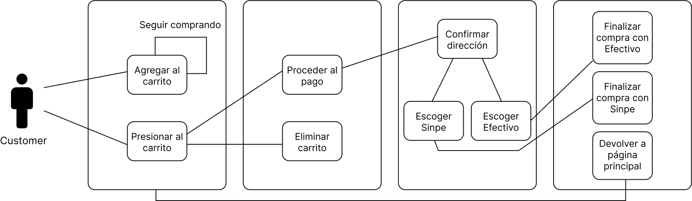
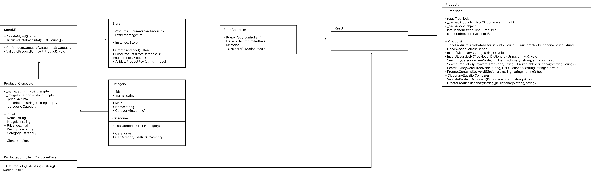
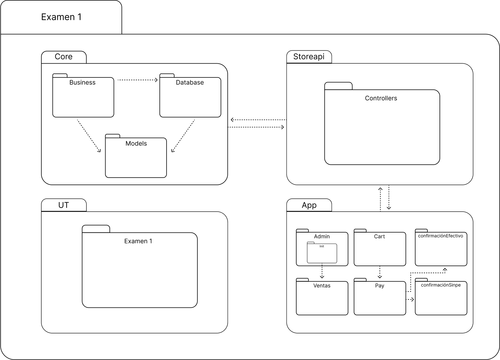

# Online Store Project

## Index

1. [Introduction](#introduction)
2. [System Architecture](#system-architecture)
3. [UML Diagrams](#uml-diagrams)
    - [Activity Diagram](#activity-diagram)
    - [Class Diagram](#class-diagram)
    - [Package Diagram](#package-diagram)
    - [Campaigns Investigation Diagram](#campaigns-investigation-diagram)
    - [Activity Diagram for Carousel and PaymentMethods](#activity-diagram-for-carousel-and-paymentmethods)
4. [Project Setup](#project-setup)
5. [Security](#security)
6. [Cache Products](#How-Product-Caching-Was-Implemented) 
   

## Introduction

This online store project was developed during the Programming Languages course. The store allows users to browse products, add them to the cart, make purchases, and view sales statistics. The implementation uses modern technologies and good development practices.

## System Architecture

The system is designed to be modular and scalable, with a microservices architecture that includes services for product management, users, authentication and authorization, and sales statistics. Communication between services is done via RESTful APIs.

## UML Diagrams

### Activity Diagram



The activity diagram shows the workflow within the system, from user authentication to making a purchase and the Search Products.

### Class Diagram



The class diagram represents the static structure of the system, showing the classes, attributes, methods, and their relationships.

### Package Diagram



The package diagram shows the modular organization of the system, grouping related classes into packages for better maintainability and scalability of the code.

### Activity Diagram for Carousel and PaymentMethods


The diagram shows the activity flows related to the product carousel and available payment methods.

### UML Diagram of the Project


This diagram provides an overview of the structure and components of the online store project.

## Project Setup

To set up the project, follow the steps below:

1. **Clone the repository**:
    ```bash
    git clone https://github.com/user/online-store.git
    cd online-store
    ```

2. **Install dependencies**:
    ```bash
    dotnet restore
    ```

3. **Configure the database**:
    - Ensure you have a configured database and update the connection string in `appsettings.json`.

4. **Run migrations**:
    ```bash
    dotnet ef database update
    ```

5. **Start the application**:
    ```bash
    dotnet run
    ```

# Security

Security in this project is implemented using JWT (JSON Web Tokens) for authentication and authorization. Below is a summary of the steps and code needed to configure this security:

1. **JWT Configuration in `Program.cs`**:
    ```csharp
    using System.Text;
    using Microsoft.AspNetCore.Authentication.JwtBearer;
    using Microsoft.IdentityModel.Tokens;
    using Microsoft.OpenApi.Models;

    var builder = WebApplication.CreateBuilder(args);

    // Configure JWT authentication services
    builder.Services.AddAuthentication(JwtBearerDefaults.AuthenticationScheme)
        .AddJwtBearer(options =>
        {
            options.TokenValidationParameters = new TokenValidationParameters
            {
                ValidateIssuer = true,
                ValidateAudience = true,
                ValidateLifetime = true,
                ValidateIssuerSigningKey = true,
                ValidIssuer = "http://localhost:7043",
                ValidAudience = "http://localhost:7043",
                IssuerSigningKey = new SymmetricSecurityKey(Encoding.UTF8.GetBytes("TheSecretKeyNeedsToBePrettyLongSoWeNeedToAddSomeCharsHere"))
            };
        });

    // Configure Swagger to include JWT authentication
    builder.Services.AddSwaggerGen(setup =>
    {
        var jwtSecurityScheme = new OpenApiSecurityScheme
        {
            BearerFormat = "JWT",
            Name = "JWT Authentication",
            In = ParameterLocation.Header,
            Type = SecuritySchemeType.Http,
            Scheme = JwtBearerDefaults.AuthenticationScheme,
            Description = "Put **_ONLY_** your JWT Bearer token on textbox below!",

            Reference = new OpenApiReference
            {
                Id = JwtBearerDefaults.AuthenticationScheme,
                Type = ReferenceType.SecurityScheme
            }
        };

        setup.AddSecurityDefinition(jwtSecurityScheme.Reference.Id, jwtSecurityScheme);

        setup.AddSecurityRequirement(new OpenApiSecurityRequirement
        {
            { jwtSecurityScheme, Array.Empty<string>() }
        });
    });
    ```

## Authentication and Authorization

### User Model and Seeder:
A user model with roles is created and a seeder is used to initialize the users.

```csharp
using System;
using System.Collections.Generic;
using System.Security.Claims;

namespace storeapi.Models
{
    public class UserAccount
    {
        public string UserName { get; }
        public string UserPassword { get; }
        public IEnumerable<Claim> UserRoles { get; }

        public static readonly List<UserAccount> allUsers = new List<UserAccount>();

        public static IEnumerable<UserAccount> AllUsersData => allUsers.AsReadOnly();

        public UserAccount(string userName, string userPassword, List<Claim> userRoles)
        {
            if (userRoles == null || userRoles.Count == 0)
                throw new ArgumentException("Roles must be created for users");
            if (string.IsNullOrEmpty(userName))
                throw new ArgumentException("Null users cannot exist");
            if (string.IsNullOrEmpty(userPassword))
                throw new ArgumentException("Password must exist");

            UserName = userName;
            UserPassword = userPassword;
            UserRoles = new List<Claim>(userRoles);

            allUsers.Add(this);
        }
    }

    public static class UserAccountSeeder
    {
        public static void SeedUsers()
        {
            new UserAccount("mariano", "123456", new List<Claim>
            {
                new Claim(ClaimTypes.Name, "mariano"),
                new Claim(ClaimTypes.Role, "Admin")
            });

            new UserAccount("juan", "234567", new List<Claim>
            {
                new Claim(ClaimTypes.Name, "juan"),
                new Claim(ClaimTypes.Role, "user")
            });

            new UserAccount("sofia", "345678", new List<Claim>
            {
                new Claim(ClaimTypes.Name, "sofia"),
                new Claim(ClaimTypes.Role, "Admin")
            });
        }
    }
}
```

## Authentication Controller:
## A controller is created to handle login requests and generate JWT tokens.
```csharp

using System;
using System.Collections.Generic;
using System.IdentityModel.Tokens.Jwt;
using System.Linq;
using System.Security.Claims;
using System.Text;
using Microsoft.AspNetCore.Authorization;
using Microsoft.AspNetCore.Hosting;
using Microsoft.AspNetCore.Mvc;
using Microsoft.IdentityModel.Tokens;
using storeapi.Models;

namespace storeapi.Controllers
{
    [Route("api/[controller]")]
    [ApiController]
    public class AuthController : ControllerBase
    {
        private readonly IWebHostEnvironment hostEnvironment;

        public AuthController(IWebHostEnvironment hostEnvironment)
        {
            this.hostEnvironment = hostEnvironment;
            UserAccountSeeder.SeedUsers();
        }

        private bool IsDevelopmentEnvironment => hostEnvironment.EnvironmentName == "Development";

        [HttpPost("login")]
        [AllowAnonymous]
        public IActionResult Login([FromBody] LoginModel user)
        {
            if (user == null || string.IsNullOrEmpty(user.userName) || string.IsNullOrEmpty(user.userPassword))
                return BadRequest("Invalid client request");

            if (IsDevelopmentEnvironment)
            {
                var existingUser = UserAccount.AllUsersData.FirstOrDefault(u => 
                    u.UserName == user.userName && u.UserPassword == user.userPassword);

                if (existingUser != null)
                {
                    var claims = new List<Claim>
                    {
                        new Claim(ClaimTypes.Name, existingUser.UserName)
                    };
                    claims.AddRange(existingUser.UserRoles);

                    var secretKey = new SymmetricSecurityKey(Encoding.UTF8.GetBytes("TheSecretKeyNeedsToBePrettyLongSoWeNeedToAddSomeCharsHere"));
                    var signinCredentials = new SigningCredentials(secretKey, SecurityAlgorithms.HmacSha256);

                    var tokenOptions = new JwtSecurityToken(
                        issuer: "http://localhost:7043",
                        audience: "http://localhost:7043",
                        claims: claims,
                        expires: DateTime.Now.AddDays(30),
                        signingCredentials: signinCredentials
                    );

                    var tokenString = new JwtSecurityTokenHandler().WriteToken(tokenOptions);

                    return Ok(new AuthenticatedResponse { Token = tokenString });
                }
            }

            return Unauthorized();
        }
    }

    public class AuthenticatedResponse
    {
        public string Token { get; set; }
    }
}
```
## Security Front-end

State Management: Uses useState to manage form data (username, password, errorMessage).
Input Handling: handleInputChange updates state when input fields change.
Form Submission:
Validates inputs to ensure they are not empty.
Sends a POST request to the authentication endpoint.
Decodes the JWT token from the response to check for the 'Admin' role.
If the user has the 'Admin' role, stores the token and redirects to the admin page.
If not, displays an error message.
UI: Renders a form with fields for username and password, and displays error messages if any.


```csharp

import React, { useState } from 'react';
import 'bootstrap/dist/css/bootstrap.css';
import jwtDecode from 'jwt-decode';

const Admin = () => {
  const [formData, setFormData] = useState({
    username: '',
    password: '',
    errorMessage: ''
  });

  const handleInputChange = (e) => {
    const { name, value } = e.target;
    setFormData({ ...formData, [name]: value });
  };

  const handleSubmit = async (e) => {
    e.preventDefault();
    const { username, password } = formData;

    if (!username.trim() || !password.trim()) {
      setFormData({ ...formData, errorMessage: 'Please fill in all fields.' });
      return;
    }

      const response = await fetch(`${process.env.NEXT_PUBLIC_API}/api/Auth/login`, {
        method: 'POST',
        headers: { 'Content-Type': 'application/json' },
        body: JSON.stringify({ userName: username, userPassword: password })
      });

      const data = await response.json();
      if (response.ok) {
        const decodedToken = jwtDecode(data.token);
        if (decodedToken.roles.includes('Admin')) {
          sessionStorage.setItem('authToken', data.token);
          window.location.href = '/admin/init';
        } else {
          setFormData({ ...formData, errorMessage: 'User does not have Admin role.' });
        }
      } else {
        setFormData({ ...formData, errorMessage: data.message || 'Invalid credentials.' });
      }
   
  };

  return (
    <div>
      <h1>Login</h1>
      <form onSubmit={handleSubmit}>
        <div>
          <label htmlFor="username">Username:</label>
          <input type="text" id="username" name="username" value={formData.username} onChange={handleInputChange} />
        </div>
        <div>
          <label htmlFor="password">Password:</label>
          <input type="password" id="password" name="password" value={formData.password} onChange={handleInputChange} />
        </div>
        <button type="submit">Login</button>
      </form>
      {formData.errorMessage && <p style={{ color: 'red' }}>{formData.errorMessage}</p>}
    </div>
  );
};

export default Admin;


```
# How Product Caching Was Implemented

Product caching was first implemented by creating an array and saving it in the database. Then, these products are retrieved from the database and stored in memory cache to improve performance. Below is a detailed explanation of how this process was implemented.

Creating and Saving Products in the Database

First, random products are created and inserted into the MySQL database. A delegate is used here to handle the insertion of products into the database.

```csharp
using System;
using System.Collections.Generic;
using MySqlConnector;
using storeapi.Models;

namespace storeapi.Database
{
    public sealed class StoreDB
    {
        // Delegate to insert a product
        public delegate void InsertProductDelegate(Product product, MySqlConnection connection, MySqlTransaction transaction);

        public static void CreateMysql()
        {
            using (var connection = new MySqlConnection(DataConnection.Instance.ConnectionString))
            {
                connection.Open();

                // Create the products table if it does not exist
                string createTableQuery = @"
                    CREATE TABLE IF NOT EXISTS products (
                        id INT AUTO_INCREMENT PRIMARY KEY,
                        name VARCHAR(100) NOT NULL,
                        price DECIMAL(10, 2) NOT NULL,
                        image TEXT NOT NULL,
                        description VARCHAR(255) NOT NULL,
                        category INT NOT NULL
                    )";

                using (var createTableCommand = new MySqlCommand(createTableQuery, connection))
                {
                    createTableCommand.ExecuteNonQuery();
                }

                // Check if there are already products in the table
                string checkProductsQuery = "SELECT COUNT(*) FROM products";
                using (var checkProductsCommand = new MySqlCommand(checkProductsQuery, connection))
                {
                    int productCount = Convert.ToInt32(checkProductsCommand.ExecuteScalar());
                    if (productCount > 0) return;
                }

                // Sample products to insert
                var products = new List<Product>
                {
                    new Product { Name = "Gizmo", Price = 19.99m, ImageUrl = "image1.jpg", Description = "A cool gizmo", Category = new Category { Id = 1 } },
                    new Product { Name = "Widget", Price = 29.99m, ImageUrl = "image2.jpg", Description = "A useful widget", Category = new Category { Id = 2 } }
                };

                InsertProducts(products, InsertProduct);
            }
        }

        // Method to insert products using a delegate
        public static void InsertProducts(List<Product> products, InsertProductDelegate insertProductDelegate)
        {
            using (var connection = new MySqlConnection(DataConnection.Instance.ConnectionString))
            {
                connection.Open();

                using (var transaction = connection.BeginTransaction())
                {
                    try
                    {
                        foreach (var product in products)
                        {
                            insertProductDelegate(product, connection, transaction);
                        }

                        transaction.Commit();
                    }
                    catch (Exception ex)
                    {
                        transaction.Rollback();
                        throw new Exception($"Error inserting products into database: {ex.Message}");
                    }
                }
            }
        }

        // Delegate method to insert a product
        public static void InsertProduct(Product product, MySqlConnection connection, MySqlTransaction transaction)
        {
            string insertProductQuery = @"
                INSERT INTO products (name, price, description, image, category)
                VALUES (@name, @price, @description, @image, @category)";

            using (var insertCommand = new MySqlCommand(insertProductQuery, connection, transaction))
            {
                insertCommand.Parameters.AddWithValue("@name", product.Name);
                insertCommand.Parameters.AddWithValue("@price", product.Price);
                insertCommand.Parameters.AddWithValue("@description", product.Description);
                insertCommand.Parameters.AddWithValue("@image", product.ImageUrl);
                insertCommand.Parameters.AddWithValue("@category", product.Category.Id);
                insertCommand.ExecuteNonQuery();
            }
        }
    }
}

```

## Retrieving Products and Storing in Memory Cache

After inserting the products into the database, they are retrieved and stored in memory cache to improve performance.

```csharp
 public class InsertProductsLogic
    {
        private readonly IMemoryCache _cache;
        private readonly InsertProductDelegate _insertProductDelegate;

        public delegate void InsertProductDelegate(Product product, MySqlConnection connection, MySqlTransaction transaction);

        public InsertProductsLogic(IMemoryCache cache, InsertProductDelegate insertProductDelegate)
        {
            _cache = cache;
            _insertProductDelegate = insertProductDelegate;
        }

        public List<Product> InsertProduct(Product product)
        {
            ValidateProduct(product);

            var products = _cache.GetOrCreate("Products", entry =>
            {
                entry.AbsoluteExpirationRelativeToNow = TimeSpan.FromMinutes(60);
                return StoreDB.RetrieveDatabaseInfo().Select(row => new Product
                {
                    Name = row[1],
                    Price = decimal.Parse(row[2]),
                    Description = row[3],
                    ImageUrl = row[4],
                    Category = new Category { Id = int.Parse(row[5]) }
                }).ToList();
            });

            using (var connection = new MySqlConnection(DataConnection.Instance.ConnectionString))
            {
                connection.Open();
                using (var transaction = connection.BeginTransaction())
                {
                    try
                    {
                        _insertProductDelegate(product, connection, transaction);
                        transaction.Commit();
                    }
                    catch (Exception ex)
                    {
                        transaction.Rollback();
                        throw new Exception($"Error inserting product into database: {ex.Message}");
                    }
                }
            }

            products.Add(product);
            _cache.Set("Products", products);

            return products;
        }

```

## Explanation of the Delegate
A delegate is a type that represents references to methods with a specific parameter list and return type. In this case, a delegate is used to handle the insertion of products into the database, allowing different implementations of the insertion method to be passed to the business logic.

``` csharp

public delegate void InsertProductDelegate(Product product, MySqlConnection connection, MySqlTransaction transaction);

This delegate defines a method that takes a Product, a MySqlConnection, and a MySqlTransaction as parameters and does not return any value (void).

Using the Delegate
The InsertProducts method uses the InsertProductDelegate to insert products into the database:

public static void InsertProducts(List<Product> products, InsertProductDelegate insertProductDelegate)
{
    using (var connection = new MySqlConnection(DataConnection.Instance.ConnectionString))
    {
        connection.Open();

        using (var transaction = connection.BeginTransaction())
        {
            try
            {
                string deleteProductsQuery = "DELETE FROM products";
                using (var deleteCommand = new MySqlCommand(deleteProductsQuery, connection, transaction))
                {
                    deleteCommand.ExecuteNonQuery();
                }

                foreach (Product product in products)
                {
                    ValidateProductForInsert(product);
                    insertProductDelegate(product, connection, transaction); // Using the delegate
                }

                transaction.Commit();
            }
            catch (Exception ex)
            {
                transaction.Rollback();
                throw new Exception($"Error inserting products into database: {ex.Message}");
            }
        }
    }
}

```
This way, the product insertion logic is flexible and can be easily modified by passing different implementations of the delegate method.

Implementing the Delegate Method
Here is an implementation of the delegate method that inserts a product into the database:
``` csharp
public static void InsertProduct(Product product, MySqlConnection connection, MySqlTransaction transaction)
{
    string insertProductQuery = @"
        INSERT INTO products (name, price, description, image, category)
        VALUES (@name, @price, @description, @image, @category)";

    using (var insertCommand = new MySqlCommand(insertProductQuery, connection, transaction))
    {
        insertCommand.Parameters.AddWithValue("@name", product.Name);
        insertCommand.Parameters.AddWithValue("@price", product.Price);
        insertCommand.Parameters.AddWithValue("@description", product.Description);
        insertCommand.Parameters.AddWithValue("@image", product.ImageUrl);
        insertCommand.Parameters.AddWithValue("@category", product.Category.Id);
        insertCommand.ExecuteNonQuery();
    }
}

```

This implementation of the delegate method performs the actual insertion of a Product into the database using a MySqlCommand.

By using a delegate, the insertion logic can be encapsulated and passed as a parameter, making the code more modular and flexible.

```
