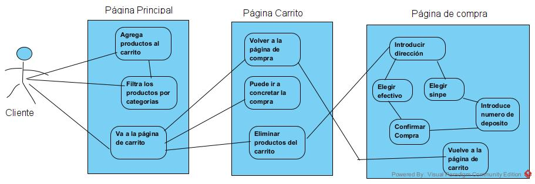

## Proyect: Store_API" - Jean Carlo Calderón Rojas

Store_API is a responsive API solution for an online store that allows to an user making purchases for different products charged by a database.

Below you wil find some important details about the aplication<

# Store_API

Store_API is a responsive API solution for an online store that allows users to make purchases for different products charged by a database.

## Project Structure

## Package Diagram


The Store_API project is structured to separate concerns effectively. The core business logic and database interactions are encapsulated within the Core package. The Store_API exposes these functionalities via a RESTful API. The lab6-nextjs-dashboard serves as the user interface, interacting with the API to provide a seamless experience for the end-users. The UML package diagram visually represents this modular structure, highlighting the relationships and dependencies between different parts of the system.

## Order Processing activity diagram


This use case diagram effectively outlines the user journey through an online store application, focusing on the client's interactions with the main page, the cart page, and the purchase page. The client starts by adding and filtering products on the main page, moves to the cart page to review their selections, and finally proceeds to the purchase page to complete their order by entering delivery information and choosing a payment method. The diagram highlights the key functionalities and navigation paths available to the client, ensuring a smooth and user-friendly shopping experience.

## Notifications Activity Diagram

This activity diagram provides a detailed view of the notification management process for both users and administrators. Users can view and delete notifications, while administrators have the ability to create, view, and delete notifications, as well as manage other notification-related tasks. The diagram ensures that each step in the workflow is clearly outlined, making it easy to understand the actions and decisions involved in managing notifications within the system.

## Shopping Flow Activity Diagram

This activity diagram provides a comprehensive view of the user's journey through the online store, from entering the main page to completing a purchase. The process includes selecting products, managing the cart, entering address details, choosing a payment method, and confirming the purchase. The diagram ensures that each step is clearly outlined, making it easy to understand the user's actions and the system's responses throughout the purchasing process.

## Payment Methods Activity Diagram

This diagram illustrates the admin’s workflow for managing payment methods in the system. The admin can log in, access the payment methods management module, and then enable or disable specific payment methods or all payment methods at once. These changes are then reflected on the checkout page to ensure that users can only use the available payment methods. If all payment methods are disabled, the system will prevent users from completing their purchases, ensuring that there is always a way for users to pay for their orders.

## Payment Methods and Shopping Flow UML Diagram

This class diagram provides a detailed view of the components involved in managing payments and sales in the Store_API system. It illustrates how different classes interact to perform tasks such as handling payment methods, managing sales transactions, and interacting with the database. The diagram highlights the relationships between the backend classes and the frontend components, ensuring a cohesive structure that supports the overall functionality of the online store.

## Security

Security is a crucial aspect of the Store_API. We ensure that the system is protected through various measures, including authentication, authorization, and secure data transmission. Below is a detailed explanation of how we manage security in the Store_API.

### Backend Security

The backend security is handled using JWT (JSON Web Tokens) for authentication and role-based authorization. Here’s a detailed explanation of how it is implemented:

1. **User Authentication and Authorization:**
    - We have a `UserAuth` class that stores user credentials and roles. Each user has a username, password, and a set of roles defined by claims.

    ```csharp
    public class UserAuth
    {
        public string UserName { get; }
        public string Password { get; }
        public IEnumerable<Claim> Roles { get; }

        public static readonly List<UserAuth> allUsers = new List<UserAuth>();

        public static IEnumerable<UserAuth> AllUsersData => allUsers.AsReadOnly();

        public UserAuth(string userName, string password, List<Claim> roles)
        {
            if (roles == null || roles.Count == 0)
                throw new ArgumentException("Must create roles for users");
            if (string.IsNullOrEmpty(userName))
                throw new ArgumentException("Null users are not allowed");
            if (string.IsNullOrEmpty(password))
                throw new ArgumentException("Password is required");

            UserName = userName;
            Password = password;
            Roles = new List<Claim>(roles);

            allUsers.Add(this);
        }
    }
    ```

2. **JWT Token Generation:**
    - The `UserAuthController` class handles the login process. Upon successful login, it generates a JWT token that includes the user’s claims.

    ```csharp
    [HttpPost("login")]
    [AllowAnonymous]
    public async Task<IActionResult> LoginAsync([FromBody] LoginModel user)
    {
        if (user == null)
            return BadRequest("Invalid client request");
        if (string.IsNullOrEmpty(user.UserName) || string.IsNullOrEmpty(user.Password))
            return BadRequest("Invalid client request");

        var existingUser = UserAuth.AllUsersData.FirstOrDefault(u =>
            u.UserName == user.UserName && u.Password == user.Password);

        if (existingUser != null)
        {
            var claims = new List<Claim>
            {
                new Claim(ClaimTypes.Name, existingUser.UserName)
            };
            claims.AddRange(existingUser.Roles);

            var secretKey = new SymmetricSecurityKey(Encoding.UTF8.GetBytes("TheSecretKeyNeedsToBePrettyLongSoWeNeedToAddSomeCharsHere"));
            var signinCredentials = new SigningCredentials(secretKey, SecurityAlgorithms.HmacSha256);

            var tokenOptions = new JwtSecurityToken(
                issuer: "https://localhost:7165",
                audience: "https://localhost:7165",
                claims: claims,
                expires: DateTime.UtcNow.AddMinutes(1),
                signingCredentials: signinCredentials
            );

            var tokenString = new JwtSecurityTokenHandler().WriteToken(tokenOptions);

            return Ok(new AuthenticatedResponse { Token = tokenString });
        }

        return Unauthorized();
    }
    ```

3. **JWT Authentication Middleware:**
    - The middleware is configured to validate JWT tokens for secured endpoints.

    ```csharp
    builder.Services.AddAuthentication(options =>
    {
        options.DefaultAuthenticateScheme = JwtBearerDefaults.AuthenticationScheme;
        options.DefaultChallengeScheme = JwtBearerDefaults.AuthenticationScheme;
    }).AddJwtBearer(options =>
    {
        options.TokenValidationParameters = new TokenValidationParameters
        {
            ValidateIssuer = true,
            ValidateAudience = true,
            ValidateLifetime = true,
            ValidateIssuerSigningKey = true,
            ValidIssuer = "https://localhost:7165",
            ValidAudience = "https://localhost:7165",
            IssuerSigningKey = new SymmetricSecurityKey(Encoding.UTF8.GetBytes("TheSecretKeyNeedsToBePrettyLongSoWeNeedToAddSomeCharsHere"))
        };
    });
    ```

### Frontend Security

The frontend security involves token management and validation to ensure that users are authenticated before accessing protected routes.

1. **Token Verification Component:**
    - The `VerifyToken` component ensures that the JWT token is valid and not expired. It checks the token every 60 seconds and redirects to the login page if the token is invalid.

    ```typescript
    import { useEffect, useState, createContext, useContext } from 'react';
    import { useRouter } from 'next/navigation';
    import { jwtDecode } from 'jwt-decode';

    const TokenContext = createContext({ isValidToken: false, isVerifying: true });

    export const useTokenContext = () => useContext(TokenContext);

    export default function VerifyToken({ children }: { children: React.ReactNode }) {
      const [isVerifying, setIsVerifying] = useState(true);
      const [isValidToken, setIsValidToken] = useState(false);
      const router = useRouter();

      const verifyToken = () => {
        const loginToken = sessionStorage.getItem("loginToken");

        if (!loginToken) {
          setIsValidToken(false);
          setIsVerifying(false);
          router.push("/../admin");
          return;
        }

        try {
          const tokenFormat: { exp: number } = jwtDecode(loginToken);
          const todayDate = Date.now() / 1000;

          if (tokenFormat.exp < todayDate) {
            setIsValidToken(false);
            sessionStorage.removeItem("loginToken");
            router.push("/../admin");
          } else {
            setIsValidToken(true);
          }
        } catch (error) {
          setIsValidToken(false);
          sessionStorage.removeItem("loginToken");
          router.push("/../admin");
        } finally {
          setIsVerifying(false);
        }
      };
    ```

2. **Login Page:**
    - The login page handles user authentication by sending the username and password to the backend and storing the JWT token in session storage upon successful authentication and validating the password format. After this, if the introduced login is correct the the user admin is redirected to an management options menu.

    ```typescript

        try {
          const response = await fetch('https://localhost:7165/api/UserAuth/login', {
            method: 'POST',
            headers: {
              'Content-Type': 'application/json'
            },
            body: JSON.stringify({ UserName: username, Password: password })
          });

          if (response.ok) {
            const data = await response.json();
            sessionStorage.setItem('loginToken', data.token);  
            setError('');
            window.location.href = '/admin/init';
          } else {
            const errorData = await response.json();
            setError(errorData.message || 'Error en la autenticación');
          }
        } catch (error) {
          setError('Error en la conexión al servidor');
        }
      };

    ```


## Product Cache

The Product Cache feature enhances performance by caching product data. This reduces the load on the database and improves response times for frequently accessed products. Below is a detailed explanation of how it is implemented.

### Backend Implementation

1. **Initializing Products:**
    - A method `GetInitialProducts` initializes a list of products.

    ```csharp
    private List<Product> GetInitialProducts()
    {
        return new List<Product>
        {
            new Product
            {
                Id = 1,
                Name = "Iphone",
                ImageURL = "/img/Iphone.jpg",
                Description= "Producto nuevo",
                Price = 200M,
                Categoria = new Category(1, "Electrónica")
            },
            new Product
            {
                Id = 2,
                Name = "Audifono",
                ImageURL = "/img/audifonos.jpg",
                Description= "Producto nuevo",
                Price = 100M,
                Categoria = new Category(1, "Electrónica")
            },
            new Product
            {
                Id = 3,
                Name = "Mouse",
                ImageURL = "/img/mouse.jpg",
                Description= "Producto nuevo",
                Price = 35M,
                Categoria = new Category(2, "Hogar y oficina")
            },
            // Other products are similarly initialized
        };
    }
    ```

2. **Inserting Products into the Database:**
    - The `InsertProductsStore` method inserts a list of products into the database.

    ```csharp
    public void InsertProductsStore(List<Product> allProducts, MySqlConnection connection)
    {
        try
        {
            foreach (var actualProduct in allProducts)
            {
                string insertQuery = @"
                    INSERT INTO Products (Name, ImageURL, Description, Price, Categoria)
                    VALUES (@name, @imageURL, @description, @price, @categoria);
                ";

                using (MySqlCommand command = new MySqlCommand(insertQuery, connection))
                {
                    command.Parameters.AddWithValue("@name", actualProduct.Name);
                    command.Parameters.AddWithValue("@imageURL", actualProduct.ImageURL);
                    command.Parameters.AddWithValue("@description", actualProduct.Description);
                    command.Parameters.AddWithValue("@price", actualProduct.Price);
                    command.Parameters.AddWithValue("@categoria", actualProduct.Categoria.IdCategory);

                    command.ExecuteNonQuery();
                }
            }
        }
        catch (Exception ex)
        {
            throw;
        }
    }
    ```

3. **Selecting Products from the Database:**
    - The `SelectProducts` method fetches products from the database and stores them in a list.

    ```csharp
    public List<Product> SelectProducts()
    {
        List<Product> productListToStoreInstance = new List<Product>();

        using (MySqlConnection connection = new MySqlConnection(connectionString))
        {
            connection.Open();
            string selectProducts = @"
                SELECT IdProduct, Name, ImageURL, Description, Price, Categoria
                FROM Products;
            ";

            using (MySqlCommand command = new MySqlCommand(selectProducts, connection))
            {
                using (MySqlDataReader readerTable = command.ExecuteReader())
                {
                    while (readerTable.Read())
                    {
                        int categoryId = Convert.ToInt32(readerTable["Categoria"]);
                        Category category = Categories.GetCategoryById(categoryId);

                        productListToStoreInstance.Add(new Product
                        {
                            Id = Convert.ToInt32(readerTable["IdProduct"]),
                            Name = readerTable["Name"].ToString(),
                            ImageURL = readerTable["ImageURL"].ToString(),
                            Description = readerTable["Description"].ToString(),
                            Price = Convert.ToDecimal(readerTable["Price"]),
                            Categoria = category
                        });
                    }
                }
            }
        }

        return productListToStoreInstance;
    }
    ```

4. **Singleton Store Class:**
    - The `Store` class is implemented as a singleton, ensuring that there is only one instance of the store, which contains the product data.

    ```csharp
    public sealed class Store
    {
        public List<Product> Products { get; private set; }
        public int TaxPercentage { get; } = 13;

        public static readonly Store Instance;

        static Store()
        {
            DB_API dbApi = new DB_API();
            dbApi.ConnectDB();

            List<Product> dbProducts = dbApi.SelectProducts();
            Instance = new Store(dbProducts);
        }

        private Store(List<Product> products)
        {
            this.Products = products;
        }

        public void AddNewProductToStore(Product newProduct)
        {
            Products.Add(newProduct);
        }
    }
    ```

5. **Store Controller:**
    - The `StoreController` class exposes endpoints to access the store data, including products and categories.

    ```csharp
    [Route("api/[controller]")]
    [ApiController]
    public class StoreController : ControllerBase
    {
        [HttpGet]
        [AllowAnonymous]
        public Store GetStore()
        {
            return Store.Instance;
        }
    ```

### Frontend Implementation

1. **Fetching Products:**
    - The frontend fetches product and category data from the backend using `fetch` API calls.

    ```typescript
    useEffect(() => {
        const loadProductData = async () => {
            try {
                const productResponse = await fetch('https://localhost:7165/api/Store');
                if (!productResponse.ok) {
                    throw new Error('Failed to fetch products');
                }
                const productJson = await productResponse.json();
                if (!Array.isArray(productJson.products)) {
                    throw new Error('Invalid product data format');
                }
                setAvailableProducts(productJson.products);
            } catch (error) {
                setError('Error al cargar productos');
            } finally {
                setLoading(false);
            }
        };
    ```

 ## Product Searcher

 ## Product Search

The Product Search feature allows users to search for products using various criteria such as name, category, and price range. This functionality ensures that users can easily find the products they are looking for.

### Backend Implementation

1. **Get Categories:**
    - The `GetCategories` method returns a list of all available product categories.

    ```csharp
    [HttpGet("Categories")]
    [AllowAnonymous]
    public IEnumerable<Category> GetCategories()
    {
        return Categories.GetCategories();
    }
    ```

2. **Get Products by Category:**
    - The `GetProductsByCategory` method returns products filtered by category ID.

    ```csharp
    [HttpGet("Products")]
    [AllowAnonymous]
    public IEnumerable<Product> GetProductsByCategory([FromQuery] int categoryId)
    {
        if (categoryId < 1)
            throw new ArgumentException($"The {nameof(categoryId)} cannot be less than 1");

        return Store.Instance.Products.Where(p => p.Categoria.IdCategory == categoryId);
    }
    ```

3. **Search Products by Name and Category:**
    - The `GetProductByNameAndCategoryIdAsync` method searches for a product by name and category ID using a binary search algorithm.

    ```csharp
        try
        {
            if (string.IsNullOrEmpty(productName) || categoryId < 1)
                throw new ArgumentException("Product name and category ID are required for search.");

            var product = await Store.Instance.GetProductByNameAndCategoryIdAsync(productName, categoryId);
            return Ok(product);
        }
        catch (KeyNotFoundException ex)
        {
            return NotFound(ex.Message);
        }
        catch (Exception ex)
        {
            return StatusCode(500, $"An error occurred: {ex.Message}");
        }
    }

    public async Task<Product> GetProductByNameAndCategoryIdAsync(string productName, int categoryId)
    {
        if (string.IsNullOrWhiteSpace(productName))
        {
            throw new ArgumentException("El nombre del producto no puede ser nulo o vacío.", nameof(productName));
        }

        if (categoryId <= 0)
        {
            throw new ArgumentException("El ID de la categoría debe ser un valor positivo.", nameof(categoryId));
        }

        var products = Store.Instance.Products.OrderBy(p => p.Name).ThenBy(p => p.Categoria.IdCategory).ToList();
        var result = await Task.Run(() => BinarySearch(products, productName, categoryId));

        if (result == null)
        {
            throw new KeyNotFoundException($"Producto con nombre '{productName}' y ID de categoría '{categoryId}' no encontrado.");
        }

        return result;
    }

    private Product BinarySearch(List<Product> products, string productName, int categoryId)
    {
        int left = 0;
        int right = products.Count - 1;

        while (left <= right)
        {
            int mid = left + (right - left) / 2;
            var currentProduct = products[mid];
            int compareResult = CompareProducts(currentProduct, productName, categoryId);

            if (compareResult == 0)
            {
                return currentProduct;
            }
            else if (compareResult < 0)
            {
                left = mid + 1;
            }
            else
            {
                right = mid - 1;
            }
        }

        return null;
    }

    private int CompareProducts(Product product, string productName, int categoryId)
    {
        int nameComparison = string.Compare(product.Name, productName, StringComparison.OrdinalIgnoreCase);
        if (nameComparison == 0)
        {
            return product.Categoria.IdCategory.CompareTo(categoryId);
        }
        return nameComparison;
    }
    ```

4. **Categories Class:**
    - The `Categories` class manages the list of categories and provides methods to access them.

    ```csharp
    public struct Category
    {
        public string NameCategory { get; set; }
        public int IdCategory { get; set; }

        public Category(int idCategory, string nameCategory)
        {
            if (idCategory < 1)
            {
                throw new ArgumentException($"Invalid category ID: {idCategory}");
            }

            if (string.IsNullOrWhiteSpace(nameCategory))
            {
                throw new ArgumentException($"Category name cannot be null or empty.");
            }

            IdCategory = idCategory;
            NameCategory = nameCategory;
        }
    }

    public class Categories
    {
        private readonly List<Category> categories = new List<Category>
        {
            new Category(1, "Electrónica"),
            new Category(2, "Hogar y oficina"),
            new Category(3, "Entretenimiento"),
            new Category(4, "Tecnología"),
        };

        public static Categories Instance { get; } = new Categories();
        private Categories() { }

        public static Category GetCategoryById(int categoryId)
        {
            var category = Instance.categories.FirstOrDefault(category => category.IdCategory == categoryId);
            if (category.IdCategory == 0)
            {
                throw new InvalidOperationException($"No category found with ID: {categoryId}");
            }
            return category;
        }

        public static IEnumerable<Category> GetCategories()
        {
            return Instance.categories.OrderBy(category => category.NameCategory);
        }
    }
    ```

### Frontend Implementation

1. **Fetching Categories:**
    - The frontend fetches the list of categories from the backend.

    ```typescript
    const loadCategoryData = async () => {
        try {
            const categoryResponse = await fetch('https://localhost:7165/api/Store/Categories');
            if (!categoryResponse.ok) {
                throw new Error('Failed to fetch categories');
            }
            const categoryJson = await categoryResponse.json();
            setCategories(categoryJson.map((category: any) => category));
        } catch (error) {
            setError('Error al cargar categorías');
        }
    };

    loadCategoryData();
    ```

2. **Fetching Products by Category:**
    - The frontend fetches products based on the selected category.

    ```typescript
    const handleCategoryChange = async (category: number) => {
        setSelectedCategory(category);
        setLoading(true);
        setError('');

        try {
            if (category === 0) {
                const productResponse = await fetch('https://localhost:7165/api/Store');
                if (!productResponse.ok) {
                    throw new Error('Failed to fetch products');
                }
                const productJson = await productResponse.json();
                setAvailableProducts(productJson.products);
            } else {
                const response = await fetch(`https://localhost:7165/api/Store/Products?categoryId=${category}`);
                if (!response.ok) {
                    throw new Error('Failed to fetch products');
                }
                const productJson = await response.json();
                const filteredProducts = productJson.filter((product: any) => product.categoria.idCategory === category);
                setAvailableProducts(filteredProducts);
            }
        } catch (error) {
            setError('Error al cargar productos');
        } finally {
            setLoading(false);
        }
    };
    ```

3. **Searching Products:**
    - The frontend allows users to search for products by name and optionally by category.

    ```typescript
    const handleSearch = async () => {
        try {
            setLoading(true);
            setError('');

            let searchUrl = `https://localhost:7165/api/Store/Search?productName=${encodeURIComponent(searchQuery)}`;

            if (selectedCategory !== 0) {
                searchUrl += `&categoryId=${selectedCategory}`;
            }

            const response = await fetch(searchUrl);
            if (!response.ok) {
                throw new Error('Failed to fetch products');
            }

            const productJson = await response.json();
            setAvailableProducts(productJson);
        } catch (error) {
            setError('Error al cargar productos');
        } finally {
            setLoading(false);
        }
    };
    ```

## Sales Report

The Sales Report feature allows administrators to generate and view sales reports. These reports can be filtered by date and provide insights into daily and weekly sales. The sales data is visualized using Google Charts.

### Backend Implementation

1. **SalesReportController:**
    - The `SalesReportController` class handles the API endpoint for fetching sales reports based on a given date.

    ```csharp
    [ApiController]
    [Route("[controller]")]
    public class SalesReportController : ControllerBase
    {
        public SalesReportController()
        {
        }

        [HttpGet]
        public async Task<IActionResult> GetSalesReportAsync(DateTime date)
        {
            try
            {
                if (date == DateTime.MinValue || date > DateTime.Now)
                {
                    return BadRequest("Invalid date. Date cannot be later than the current date.");
                }

                var saleReportLogic = new SaleReportLogic();
                var salesReport = await saleReportLogic.GenerateSalesReportAsync(date);

                return Ok(salesReport);
            }
            catch (Exception ex)
            {
                return StatusCode(500, $"An error occurred while generating the sales report: {ex.Message}");
            }
        }
    }
    ```

2. **SaleReportLogic:**
    - The `SaleReportLogic` class contains the business logic for generating sales reports, fetching daily and weekly sales data from the database.

    ```csharp
    public class SaleReportLogic
    {
        public async Task<SalesReport> GenerateSalesReportAsync(DateTime date)
        {
            if (date == DateTime.MinValue)
            {
                throw new ArgumentException("The date cannot be DateTime.MinValue.", nameof(date));
            }

            if (date > DateTime.Now)
            {
                throw new ArgumentOutOfRangeException(nameof(date), "The date cannot be later than the current date.");
            }

            var dailySalesTask = dbApi.ObtainDailySalesAsync(date);
            var weeklySalesTask = dbApi.ObtainWeeklySalesAsync(date);

            await Task.WhenAll(dailySalesTask, weeklySalesTask);

            var dailySales = await dailySalesTask;
            var weeklySales = await weeklySalesTask;

            var salesReport = new SalesReport
            {
                Date = date,
                DailySales = dailySales,
                WeeklySales = weeklySales
            };

            return salesReport;
        }

    ```

### Frontend Implementation

1. **Sales Report Component:**
    - The `Graphic` component fetches and displays daily and weekly sales data using Google Charts.

    ```typescript
    import React, { useState, useEffect } from 'react';
    import { Chart } from 'react-google-charts';
    import VerifyToken, { useTokenContext } from '@/app/components/verify_token';
    import { useRouter } from 'next/navigation';

    interface SalesAttribute {
      saleId: number;
      purchaseNumber: string;
      total: number;
      purchaseDate: string; // Changed to string based on backend response
      product: string;
      dailySale: string;
      saleCounter: number;
    }

    const Graphic = () => {
      const { isValidToken, isVerifying } = useTokenContext();
      const router = useRouter();
      const [selectedDate, setSelectedDate] = useState(new Date());
      const [dailySales, setDailySales] = useState<SalesAttribute[]>([]);
      const [weeklySales, setWeeklySales] = useState<[string, string][]>([]);
      const [loading, setLoading] = useState(false);
      const [error, setError] = useState('');

      const fetchData = async () => {
        if (!isValidToken) {
          return;
        }

        setLoading(true);
        try {
          const formattedDate = selectedDate.toISOString().split('T')[0]; // Formato yyyy-MM-dd
          const response = await fetch(`https://localhost:7165/api/SalesReport?date=${formattedDate}`);

          if (!response.ok) {
            throw new Error('Failed to fetch sales data');
          }

          const data = await response.json();

          if (!data || !data.dailySales || !data.weeklySales) {
            throw new Error('Sales data is empty or missing');
          }

          const formattedDailySales: SalesAttribute[] = data.dailySales.map((sale: any) => ({
            saleId: sale.saleId,
            purchaseNumber: sale.purchaseNumber,
            total: sale.total,
            purchaseDate: new Date(sale.purchaseDate).toLocaleDateString(),
            product: sale.product,
            dailySale: sale.dailySale,
            saleCounter: sale.saleCounter
          }));

          setDailySales(formattedDailySales);

          const weeklySalesData: [string, string][] = data.weeklySales.reduce((acc: any[], current: any) => {
            if (current.dailySale && current.total) {
              acc.push([current.dailySale, current.total.toString()]); // Asegúrate de que total sea string para el Chart
            }
            return acc;
          }, []);

          weeklySalesData.unshift(['Day', 'Total Sales']);

          setWeeklySales(weeklySalesData);

          setError('');
        } catch (error) {
          setError('Error fetching sales data');
        } finally {
          setLoading(false);
        }
      };

      const handleDateChange = (e: React.ChangeEvent<HTMLInputElement>) => {
        setSelectedDate(new Date(e.target.value));
      };

      useEffect(() => {
        if (isValidToken && !isVerifying) {
          fetchData();
        }
      }, [isValidToken, isVerifying, selectedDate]);
    ```


