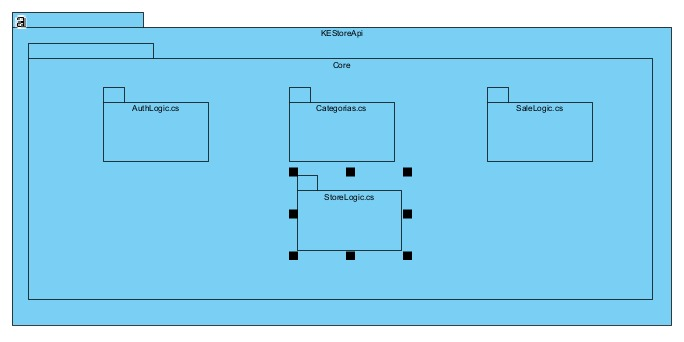
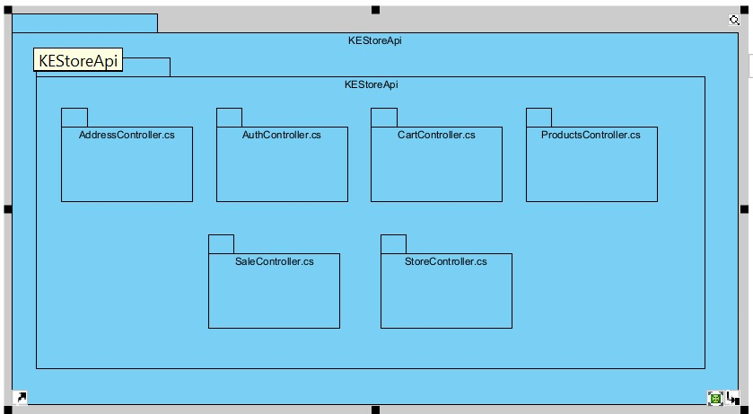
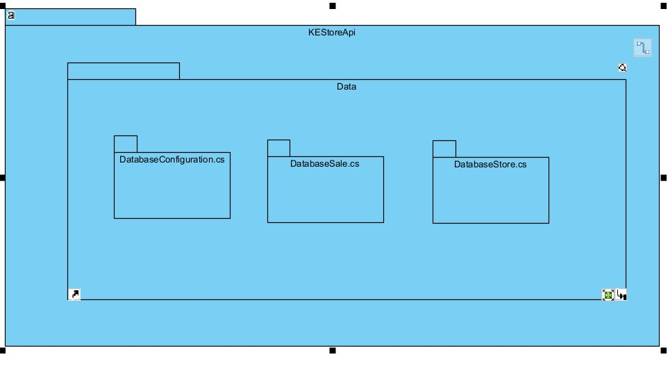
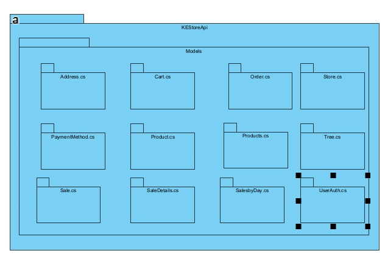

# Web Pages: KEStoreAPi

**Estudiante:** Kendall Sánchez Chinchilla
**Carné:** C27227
---

## Descripción del Proyecto

El propósito de este proyecto es desarrollar una tienda en línea utilizando React y Next.js. La aplicación permite a los usuarios una experiencia de compra donde pueden ver productos, añadirlos al carrito de compras, buscar por categoría, nombre y descripción, y proceder a la compra.

## Características
- Catálogo de productos
- Carrito de compras
- Proceso de pago
- Gestión de inventario
- Gestión de métodos de pago

---

## Diagramas:

### Diagrama de Actividad

### Diagrama de Componentes

**Business**

**Controllers**

**Data**

**Models**

**UT**

---

## Front-end

El front-end de la aplicación está construido con React y Next.js, y consta de varios componentes organizados en diferentes carpetas.

#### Estructura de Carpetas
- `page.tsx`: Este componente principal renderiza la página principal de la aplicación.
- `app/admin`: Este componente representa la sección de administración de la aplicación y contiene subcomponentes para diferentes tareas administrativas.
- `app/cart`: Este componente es responsable de mostrar el carrito de compras del usuario.
- `app/confirm`: Este componente es para confirmar el pedido del usuario.
- `app/payment`: Este componente es para procesar el pago del pedido del usuario e ingresar los datos de compra.
- `app/hooks`: Contiene hooks personalizados para manejar lógica específica.
- `app/ui`: Componentes de la interfaz de usuario.

#### Dependencias del Front-end
- React
- Next.js

---

## Back-end

El back-end está construido con ASP.NET Core y contiene la lógica de negocio central de la aplicación.

#### Estructura de Carpetas
- `Core`: Contiene las clases y funciones principales de la aplicación.
  - `Business`: Contiene clases y funciones relacionadas con las reglas de negocio de la aplicación.
    - `AuthLogic.cs`
    - `Categorias.cs`
    - `SaleLogic.cs`
    - `StoreLogic.cs`
  - `Data`: Contiene clases y funciones para interactuar con la base de datos.
    - `DatabaseConfiguration.cs`
    - `DatabaseSale.cs`
    - `DatabaseStore.cs`
  - `Models`: Contiene las clases que representan los modelos de datos de la aplicación.
    - `Address.cs`
    - `Cart.cs`
    - `Categoria.cs`
    - `Order.cs`
    - `PaymentMethod.cs`
    - `Product.cs`
    - `Products.cs`
    - `Sale.cs`
    - `SaleDetails.cs`
    - `SalesbyDay.cs`
    - `Store.cs`
    - `Tree.cs`
    - `UserAuth.cs`
- `KEStoreApi`: Contiene los controladores API para enviar y recibir datos desde el front-end.
  - `Controllers`
    - `AddressController.cs`
    - `AuthController.cs`
    - `CartController.cs`
    - `ProductsController.cs`
    - `SaleController.cs`
    - `StoreController.cs`
- `UT`: Contiene las pruebas unitarias para el código del back-end.
- `Program.cs`: Configuración inicial y arranque de la aplicación.

#### Dependencias del Back-end
- ASP.NET Core
- Entity Framework Core

---

## Dependencias

- El front-end depende del back-end para obtener datos y realizar acciones.
- Los componentes del front-end se comunican con el back-end a través de APIs.
- El back-end depende de la base de datos para almacenar y recuperar datos.

---

## Diagramas

### Búsqueda de Producto por Categoría y Consulta

### Habilitar y Deshabilitar Métodos de Pago

### Diagrama para Flujo de Compra

---

## Funciones Principales del Sistema

- **StoreDB**: Representa la base de datos donde se almacena la información del sistema.
- **SaleDB**: Representa la base de datos donde se almacenan las compras.
- **SaleReport**: Esta clase es responsable de generar informes de ventas.
- **SaleReportLogic**: Esta clase proporciona la lógica para generar informes de ventas.
- **StoreLogic**: Esta clase proporciona la lógica para interactuar con la base de datos de la tienda.

### Flujo de Datos

1. El usuario realiza una solicitud a la página principal.
2. Los controladores reciben la solicitud y la procesan.
3. Los controladores interactúan con los modelos para recuperar o modificar datos en la base de datos.
4. Los controladores interactúan con las vistas para generar la respuesta al usuario.
5. Las vistas envían la respuesta al usuario.
